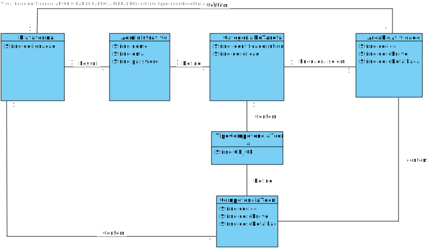

# UC3 - Definir Categoria (de tarefa)

## 1. Engenharia de Requisitos

### Formato Breve

O administrativo inicia a funcionalidade de criar  uma nova categoria de tarefa. O sistema solicita os dados necessários (i.e. identificador interno automático, descrição, área de atividade em que se enquadra e lista de competências técnicas para a realização de tarefas dessa categoria).
O administrativo introduz os dados solicitados. O sistema valida e apresenta os dados ao administrativo, pedindo que os confirme.  O administrativo irá então confirmar se todos os dados se encontram corretos.
O sistema regista os dados e informa o administrativo do sucesso da operação.

### SSD

### Formato Completo

#### Ator principal

Administrativo

#### Partes interessadas e seus interesses

(identificar as partes interessadas e seus interesses)

* **Administrativo:** permite que este defina as categorias das tarefas .
* **T4J:** Permite catalogar as categorias das tarefas .
* **Freelancers::** Permite uma escolha mais fácil das tarefas que poderá executar .

#### Pré-condições
N/A

#### Pós-condições
A definição das categorias de tarefas é registada no sistema.

#### Cenário de sucesso principal (ou fluxo básico)
1. O Administrativo inicia a definição de uma categoria (de tarefa).
2. O Sistema solicita uma descrição relativa à categoria (de tarefa).
3. O Administrativo introduz os dados solicitados.
4. O Sistema mostra uma lista das áreas de atividade.
5. O Administrativo escolhe a área de atividade.
6. O Sistema solicita as competências técnicas requeridas (Desejáveis e Obrigatórias).
7. O Administrativo introduz as competências técnicas (Desejáveis e Obrigatórias).
8. Repetir o passo 6 e 7 até que o Administrativo pretenda.
9. O Sistema valida e apresenta os dados e pede para confirmar.
10. O Administrativo confirma os dados.
11. O Sistema guarda os dados e informa o Administrativo do sucesso da operação.

#### Extensões (ou fluxos alternativos)

4a. O sistema deteta que a lista áreas de atividade de está vazia.
>Caso de uso termina.

6a. O sistema deteta que a lista de competências técnicas está vazia.
>Caso de uso termina.

9a. Dados mínimos obrigatórios em falta.
>	1. O sistema informa quais os dados em falta.
>	2. O sistema permite a introdução dos dados em falta (passo 3)
>
	>	2a. O administrativo não altera os dados. O caso de uso termina.

9b. O sistema deteta que os dados (ou algum subconjunto dos dados) introduzidos devem ser únicos e que já existem no sistema.
>	1. O sistema alerta o administrativo para o facto.
>	2. O sistema permite a sua alteração (passo 3)
>
	>	2a. O administrativo não altera os dados. O caso de uso termina.

9c. O sistema deteta que os dados introduzidos (ou algum subconjunto dos dados) são inválidos.
> 1. O sistema alerta o administrativo para o facto.
> 2. O sistema permite a sua alteração (passo 3).
>
	> 2a. O administrativo não altera os dados. O caso de uso termina.

#### Requisitos especiais
--

\-

#### Lista de Variações de Tecnologias e Dados
--
\-

#### Frequência de Ocorrência
Cada vez que o administrativo pretender definir uma nova categoria (de tarefa).

\-

#### Questões em aberto

* O código único é sempre introduzido pelo administrativo ou o sistema deve gerá-lo automaticamente?
* Qual a frequência de ocorrência deste caso de uso?

## 2. Análise OO

### Excerto do Modelo de Domínio Relevante para o UC

## 3. Design - Realização do Caso de Uso

### Racional

 | Fluxo Principal | Questão: Que Classe... | Resposta  | Justificação  |
 |:--------------  |:---------------------- |:----------|:---------------------------- |
 | 1. O Administrativo inicia a definição de uma nova área de atividade.   		 |	... interage com o utilizador? | DefinirCategoriaUI    |  Pure Fabrication, pois não se justifica atribuir esta responsabilidade a nenhuma classe existe no Modelo de Domínio. |
 |  		 |	... coordena o UC?	| DefinirCategoriaController
 | Controller    |
 |  		 |	... cria instância de CategoriaTarefa| Plataforma   | Creator (Regra1)   |
 | 2. O Sistema solicita uma descrição relativa à categoria (de tarefa).  		 |							 |             |                              |
 | 3. O Administrativo introduz os dados solicitados.		 |	... guarda a categoria (de tarefa)?  |   CategoriaTarefa | Information Expert (IE) - instância criada no passo 1     |
 | 4. O Sistema mostra uma lista das áreas de atividade.  		 |							 |             |                              |
 | 5. O Administrativo escolhe a área de atividade.		 |	... contém os dados guardados?  |   AreaDeAtividade | Objeto já foi criaco no caso de uso 2(uc2).     |      
 | 6. O Sistema solicita as competências técnicas requeridas (Desejáveis e Obrigatórias).  		 |							 |             |                              |
 | 7. O Administrativo introduz as competências técnicas.		 |	... guarda as competências introduzidas?  |   CategoriaDeTarefa | Information Expert (IE) - instância criada no passo 1     |
| 8. O Sistema valida e apresenta os dados e pede para confirmar.		 |	... valida  a categoria (de tarefa) criada (validação local)?  |   CategoriaDeTarefa |  |
|  |	... valida  a categoria (de tarefa) criada (validação global)?  |   Plataforma | Information Expert (IE) - No MD a Plataforma possui Categoria de Tarefa.     |
| 9. O Administrativo confirma os dados.		 |  |  |     |
 | 10. O Sistema guarda os dados e informa o Administrativo do sucesso da operação.	 |	... guarda a categoria (de tarefa) criada?  |   Plataforma | Information Expert (IE) - No MD a Plataforma possui Categoria de Tarefa.     |

### Sistematização ##

Do racional resulta que as classes conceptuais promovidas a classes de software são:

 * Plataforma
 * Organizacao
 * Colaborador
 * CategoriaDeTarefa

Outras classes de software (i.e. Pure Fabrication) identificadas:  

 * DefinirCategoriaUI  
 * DefinirCategoriaController

###	Diagrama de Sequência

###	Diagrama de Classes

