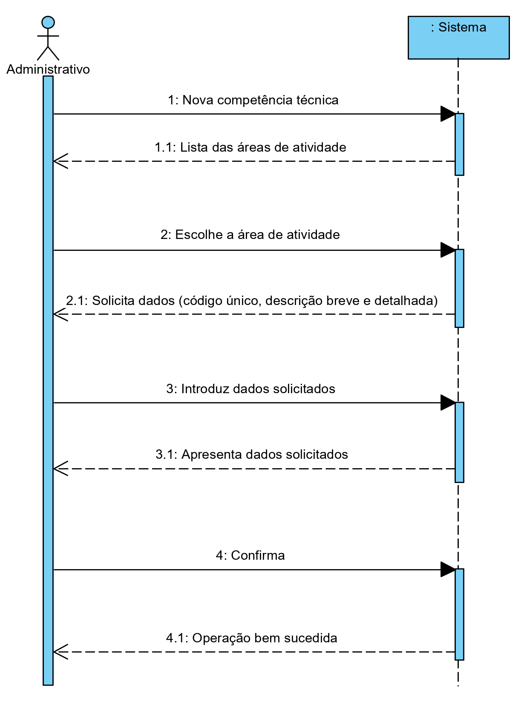
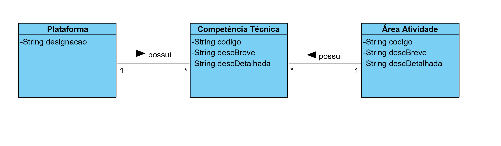
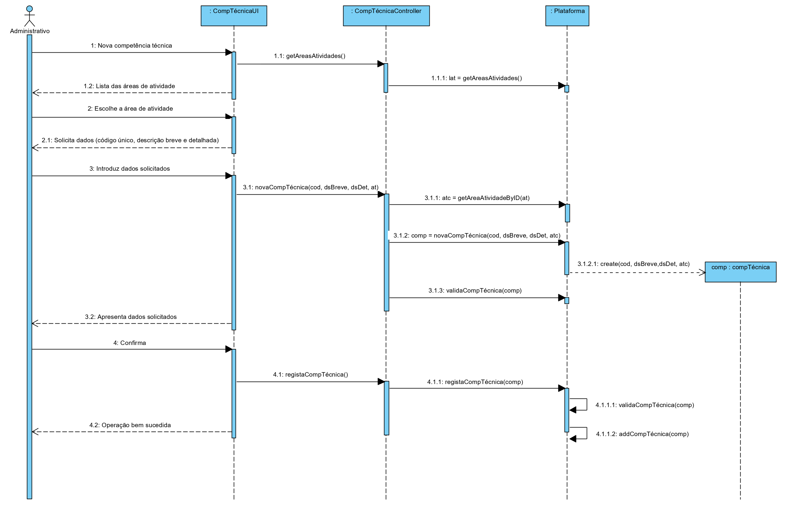
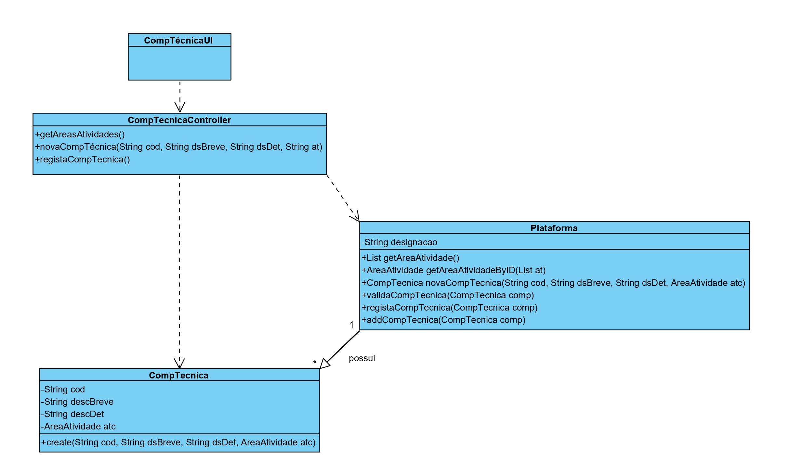

# UC4 - Especificar competência técnica

## 1. Engenharia de Requisitos

### Formato Breve

O administrativo inicia a definição de uma nova competência técnica. O sistema demonstra a lista das áreas de atividade. O administrativo escolhe a área de atividade a que pretende inserir uma competência técnica. O sistema começa por solicitar os dados necessários (i.e. Um código único, uma descrição breve e outra mais detalhada). O administrativo introduz os dados solicitados. O sistema valida e apresenta os dados ao administrativo, pedindo que os confirme. O administrativo confirma. O sistema regista os dados e informa o administrativo do sucesso da operação.

### SSD

### Formato Completo

#### Ator principal

Administrativo

#### Partes interessadas e seus interesses
* **Administrativo:** pretende especificar as competências técnicas.
* **T4J:** pretende que a plataforma permita catalogar as competências técnicas para determinadas áreas de trabalho.

#### Pré-condições
n/a

#### Pós-condições
A informação das competências técnicas são registadas no sistema.

### Cenário de sucesso principal (ou fluxo básico)

1. O administrativo inicia a especificação de uma competência técnica.
2. O sistema demonstra a lista das áreas de atividade.
3. O administrativo escolhe a área de atividade a que pretende inserir uma competência técnica.
4. O sistema solicita os dados necessários (i.e. Um código único, uma descrição breve e outra mais detalhada).
5. O administrativo introduz os dados solicitados.
6. O sistema valida e apresenta os dados ao administrativo, pedindo que os confirme.
7. O administrativo confirma.
8. O sistema regista os dados e informa o administrativo do sucesso da operação.

#### Extensões (ou fluxos alternativos)

*a. O administrativo solicita o cancelamento da definição da competência técnica.

> O caso de uso termina.

4a. O administrativo não escolhe uma área de atividade da lista.
>	1. O sistema informa a escolha em falta.
>	2. O sistema permite a escolha da  área de atividade da lista (passo 3)
>
	>	2a. O administrativo não faz a escolha. O caso de uso termina.

4b. Dados mínimos obrigatórios em falta.
>	1. O sistema informa quais os dados em falta.
>	2. O sistema permite a introdução dos dados em falta (passo 5)
>
	>	2a. O administrativo não altera os dados. O caso de uso termina.

4b. O sistema deteta que os dados (ou algum subconjunto dos dados) introduzidos devem ser únicos e que já existem no sistema.
>	1. O sistema alerta o administrativo para o facto.
>	2. O sistema permite a sua alteração (passo 5)
>
	>	2a. O administrativo não altera os dados. O caso de uso termina.

4c. O sistema deteta que os dados introduzidos (ou algum subconjunto dos dados) são inválidos.
> 1. O sistema alerta o administrativo para o facto.
> 2. O sistema permite a sua alteração (passo 5).
>
	> 2a. O administrativo não altera os dados. O caso de uso termina.

#### Requisitos especiais
\-

#### Lista de Variações de Tecnologias e Dados
\-

#### Frequência de Ocorrência
\-

#### Questões em aberto

* Existem outros dados que são necessários?
* Todos os dados são obrigatórios?
* O código único é sempre introduzido pelo administrativo ou o sistema deve gerá-lo automaticamente?
* Qual a frequência de ocorrência deste caso de uso?

## 2. Análise OO

### Excerto do Modelo de Domínio Relevante para o UC

## 3. Design - Realização do Caso de Uso

### Racional

| Fluxo Principal | Questão: Que Classe... | Resposta  | Justificação  |
|:--------------  |:---------------------- |:----------|:---------------------------- |
| 1. O administrativo inicia uma nova competência técnica.   		 |	... interage com o utilizador? | CompTécnicaUI    |  Pure Fabrication, pois não se justifica atribuir esta responsabilidade a nenhuma classe que existe no Modelo de Domínio. |
|  		 |	... coordena o UC?	| CompTécnicaController | Controller    |
|  		 |	... vai adquirir a lista das áreas de atividades | Plataforma   | Vai devolver a lista de áreas de atividade |
| 2. O sistema demonstra uma lista com as áreas de atividades para o administrativo escolher.  		 |							 |             |                              |
| 3. O administrativo escolhe a área de atividade à qual pretende adicionar uma competência técnica.  		 |	... guarda a área de atidade escolhida?  |   CompetênciaTécnica | Information Expert (IE) - instância criada no passo 1     |
| 4. O sistema solicita os dados necessários (i.e. Um código único, uma descrição breve e outra mais detalhada).  		 |							 |             |                              |
| 5. O administrativo escolhe a área de atividade à qual pretende adicionar uma competência técnica e introduz os dados solicitados.  		 |	... guarda os dados introduzidos?  |   CompetênciaTécnica | Envia os dados para o Controller |
|   		 |	... vai adquirir o ID da area de atividade?  |   Plataforma | Envia as informações da área de atidade escolhida |
|   		 |	... envia os dados da nova CompetênciaTécnica?  | Plataforma | Guardar os dados recebidos |
|   		 |	... cria a nova competência técnica?  | compTécnica | Gera a nova competência técnica na plataforma |
|   		 |	... valida a nova competência técnica?  | Plataforma | Valida os dados da nova competência técnica introduzida |
| 6. O sistema apresenta os dados ao administrativo, pedindo que os confirme.  		 |							 |             |                              |
| 7. O administrativo comfirma os dados.   		 |	...regista a CompetênciaTécnica (validação local) | CompetênciaTécnica |                              |  	
|	 |	...regista a nova CompetênciaTécnica na Plataforma | Plataforma  | Envia os dados para a mesma |
|	 |	...valida a CompetênciaTécnica | Plataforma  | Validação da CompetênciaTécnica |
|	 |	...adiciona a nova CompetênciaTécnica | Plataforma  | Introdução da nova CompetênciaTécnica |
| 8. O sistema regista os dados e informa o administrativo do sucesso da operação.  		 |	|  | |  

### Sistematização ##

 Do racional resulta que as classes conceptuais promovidas a classes de software são:

 * Plataforma
 * CompetênciaTécnica

Outras classes de software (i.e. Pure Fabrication) identificadas:  

 * CompetênciaTécnicaUI  
 * CompetênciaTécnicaController

###	Diagrama de Sequência

###	Diagrama de Classes

