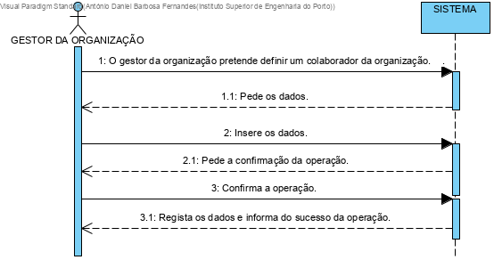

# UC5 - Especificar Colaborador de Organização

## 1. Engenharia de Requisitos

### Formato Breve

O gestor quer adicionar utlizadores como colaboradors da mesma organização

### SSD

### Formato Completo

#### Ator principal

Gestor de organização

#### Partes interessadas e seus interesses
* **Gestor de Organização:** especificar outros colaboradors da determinada organização.
* **T4J:** pretende que a plataforma permita catalogar os colaboradores das organizações.

#### Pré-condições

N/A

#### Pós-condições
O Gestor adicionou um utlizador como um novo colaborador da mesma organização

### Cenário de sucesso principal (ou fluxo básico)

#### Extensões (ou fluxos alternativos)
1. O Gestor adiciona o colaborador
2. O Sistema pede os dados do colaborador ( nome funcao telfone email)
3. O Gestor insere os dados
4. O Sistema verifica os Dados e pede confirmação
5. O gestor confirma
6. O Sistema guardar os dados  e registar como um colaborador

a. O gestor diz não na confirmação
   "Sistema volta para o ecrã anterior(da plataforma) "
#### Requisitos especiais
Fazer uma opção para aumentar o texto.

#### Lista de Variações de Tecnologias e Dados
Mudança de colaboradors.

#### Frequência de Ocorrência
Sempre que a organização quer adicionar um novo colaborador

#### Questões em aberto

* Existem outros dados que são necessários?
* Todos os dados são obrigatórios?  
* O código único é sempre introduzido pelo administrativo ou o sistema deve gerá-lo automaticamente?

## 2. Análise OO

## 3. Design - Realização do Caso de Uso

### Racional

| Fluxo Principal                        | Questão: Que Classe...  | Resposta               | Justificação                      |
|:---------------------------------------|:------------------------|:-----------------------|:----------------------------------|
| 1. O Gestor adiciona o colaborador     |  ...quem interaje com   |  addcolaboradorUI      |  Pure Fabrication                 |
|                                        | o Gestor                |                        |                                   |
|                                        | ... quem codena o UC    | addcolaboradorControler|   Controler                       |
|----------------------------------------|-------------------------|------------------------|-----------------------------------|
|2.O Sistema pede os dados do colaborador|                         |                        |                                   |
|----------------------------------------|-------------------------|------------------------|-----------------------------------|
|3. O Gestor insere os dados             |... guarda os dados      | Colaborador            |                                   |
|                                        | introduzidos?           |                        |                                   |
|----------------------------------------|-------------------------|------------------------|-----------------------------------|
|4. O Sistema verifica os Dados          |... valida os dados da   | organização            |IE : organização tem colaborador   |          
|e pede confirmação                      | Organizacao (global)    |                        |                                   |
|                                        |                         |                        |                                   |
|                                        | introduzidos?           |                        |                                   |
|                                        |... valida os dados do   | colaborador            |IE: possui os seus próprios dados  |
|                                        | colaborador(local)      |                        |                                   |
|----------------------------------------|-------------------------|------------------------|-----------------------------------|
|5.O gestor confirma                     |                         |                        |                                   |
|----------------------------------------|-------------------------|------------------------|-----------------------------------|
|6. O Sistema guardar os dados           |... guarda a colaborador | colaborador            |IE:N oMD a organização             |                                         |                                        |                         |                        | tem colaborador                   |
|  e registar como um colaborador        |criado?                  |                        |                                   |    

### Sistematização ##

 Do racional resulta que as classes conceptuais promovidas a classes de software são:

 * Plataforma
 * Organizador
 *

Outras classes de software (i.e. Pure Fabrication) identificadas:  

 * addcolaboradorUI  
 * addcolaboradorControler

###	Diagrama de Sequência

###	Diagrama de Classes

  
