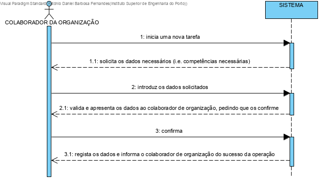
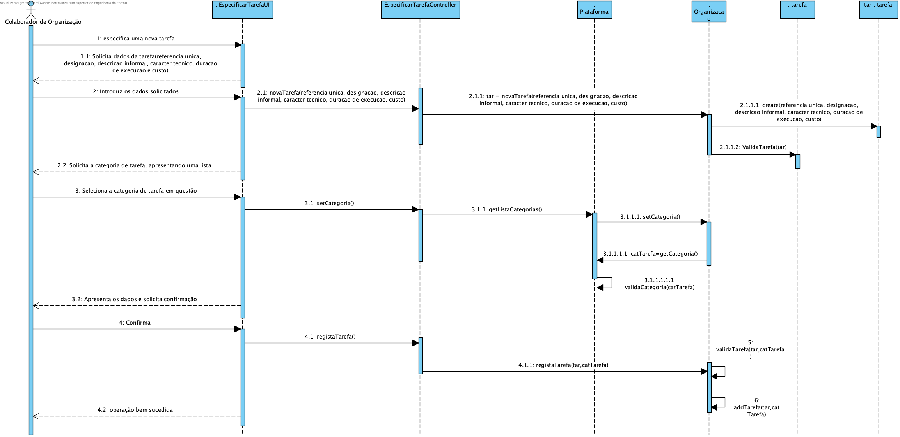

# UC6 - Especificar tarefa

## 1. Engenharia de Requisitos

### Formato Breve

O colaborador de organização especifica uma nova tarefa. O sistema começa por solicitar os dados necessários (referencia unica, designacao, descricao informal, caracter tecnico, duracao de execucao e custo). O colaborador de organização introduz os dados solicitados. O sistema valida e apresenta os dados ao colaborador de organização, pedindo que os confirme. O colaborador irá então confirmar se todos os dados se encontram corretos.O sistema solicita a categoria de tarefa, apresentando uma lista. O colaborador de organização seleciona a categoria de tarefa em questão. O sistema apresenta os dados e solicita confirmação. O colaborador confirma. O sistema regista os dados e informa o colaborador de organização do sucesso da operação.

### SSD

### Formato Completo

#### Ator principal

Colaborador de Organização

#### Partes interessadas e seus interesses
* **Colaborador de Organização:** pretende especificar novas tarefas.
* **T4J:** pretende que a plataforma permita catalogar as necessárias para as áreas de trabalho.
* **Freelancers:** Possibilidade de estes saberem as tarefas que são propostas pelo trabalho.

#### Pré-condições
O administrativo tem de definir a área de atividade, categoria de tarefa e especificar as competências técnicas.

#### Pós-condições
A informação das tarefas são registadas no sistema.

### Cenário de sucesso principal (ou fluxo básico)

1. O colaborador de organização especifica uma nova tarefa.
2. O sistema começa por solicitar os dados necessários (referencia unica, designacao, descricao informal, caracter tecnico, duracao de execucao e custo).
3. O colaborador de organização introduz os dados solicitados.
4. O sistema valida e apresenta os dados ao colaborador de organização, pedindo que os confirme.
5. O colaborador irá então confirmar se todos os dados se encontram corretos.
6. O sistema solicita a categoria de tarefa, apresentando uma lista.
7. O colaborador de organização seleciona a categoria de tarefa em questão.
8. O sistema apresenta os dados e solicita confirmação.
9. O colaborador confirma.
10. O sistema regista os dados e informa o colaborador de organização do sucesso da operação.

#### Extensões (ou fluxos alternativos)

*a. O colaborador de organização solicita o cancelamento da nova tarefa.

> O caso de uso termina.

3a. Dados mínimos obrigatórios em falta.
>	1. O sistema informa quais os dados em falta.
>	2. O sistema permite a introdução dos dados em falta (passo 3)
>
	>	2a. O colaborador de organização não altera os dados. O caso de uso termina.

3b. O sistema deteta que os dados (ou algum subconjunto dos dados) introduzidos devem ser únicos e que já existem no sistema.
>	1. O sistema alerta o colaborador de organização para o facto.
>	2. O sistema permite a sua alteração (passo 3)
>
	>	2a. O colaborador de organização não altera os dados. O caso de uso termina.

3c. O sistema deteta que os dados introduzidos (ou algum subconjunto dos dados) são inválidos.
> 1. O sistema alerta o colaborador de organização para o facto.
> 2. O sistema permite a sua alteração (passo 3).
>
	> 2a. O colaborador de organização não altera os dados. O caso de uso termina.

#### Requisitos especiais
\-

#### Lista de Variações de Tecnologias e Dados
\-

#### Frequência de Ocorrência
Cada vez que o colaborador da organização pretender especificar uma tarefa.

#### Questões em aberto

* Existem outros dados que são necessários?
* Todos os dados são obrigatórios?
* O código único é sempre introduzido pelo administrativo ou o sistema deve gerá-lo automaticamente?
* Qual a frequência de ocorrência deste caso de uso?

## 2. Análise OO

### Excerto do Modelo de Domínio Relevante para o UC

## 3. Design - Realização do Caso de Uso

### Racional

| Fluxo Principal | Questão: Que Classe... | Resposta  | Justificação  |
|:--------------  |:---------------------- |:----------|:---------------------------- |
| 1. O colaborador de organização inicia uma nova tarefa.   		 |	... interage com o utilizador? | EspecificarTarefaUI
|  Pure Fabrication, pois não se justifica atribuir esta responsabilidade a nenhuma classe existe no Modelo de Domínio. |
|  		                                                           |	... coordena o UC?	| EspecificarTarefaController | Controller    |
|  		 																													 |	... cria instância de EspecificarTarefa| Plataforma | Creator (Regra1)   |
| 2. O sistema começa por solicitar os dados necessários (referencia unica, designacao, descricao informal, caracter tecnico, duracao de execucao e custo).  		 |							 |             |                              |
| 3. O colaborador de organização introduz os dados solicitados. |	... guarda tarefa escolhida?  |   EspecificarTarefa
| Information Expert (IE) - instância criada no passo 1     |
| 4. O sistema valida e apresenta os dados ao colaborador de organização, pedindo que os confirme.
|	...valida os dados do Serviço (validação local)?					|  EspecificarTarefa     |  IE: EspecificarTarefa possui os
seus próprios dados |
|...valida os dados do Serviço (validação global)           | Plataforma						 | IE: A Empresa
contém/agrega Serviço|
| 5. O colaborador de organização confirma.  		 | |    |   |
| 6. O sistema solicita a categoria de tarefa, apresentando uma lista.   		 |...conhece as
categorias existentes a listar?| Plataforma | IE: Plataforma tem/agrega todas as Categoria |
| 7. O colaborador de organização seleciona a categoria de tarefa em questão.   		 |.. guarda a categoria
selecionada?|  EspecificarTarefa     |  IE: Servico catalogado numa Categoria - instância criada no passo 1       |
| 8. O sistema apresenta os dados e solicita confirmação.
|	...valida os dados do Serviço (validação local)?					|  EspecificarTarefa     |  IE: EspecificarTarefa possui os
seus próprios dados |
|...valida os dados do Serviço (validação global)           | Plataforma						 | IE: A Empresa
contém/agrega Serviço|
| 9. O colaborador confirma. |   |      |    |
| 10. O sistema regista os dados e informa o administrativo do sucesso da operação.  		 |	... guarda a especificação da tarefa? | Plataforma  | IE: No MD a Plataforma possui EspecificarTarefa|  
| ... notifica o utilizador? | EspecificarTarefaUI |        |

### Sistematização ##

 Do racional resulta que as classes conceptuais promovidas a classes de software são:

 * Plataforma
 * EspecificarTarefa

Outras classes de software (i.e. Pure Fabrication) identificadas:  

 * EspecificarTarefaUI  
 * EspecificarTarefaController

###	Diagrama de Sequência

###	Diagrama de Classes
