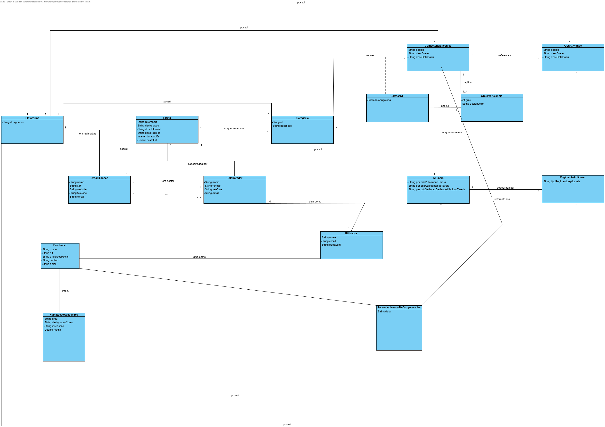

# Análise OO #
O processo de construção do modelo de domínio é baseado nos casos de uso, em especial os substantivos utilizados, e na descrição do enunciado.
## Racional para identificação de classes de domínio ##
Para a identificação de classes de domínio usa-se a lista de categorias das aulas TP (sugeridas no livro). Como resultado temos a seguinte tabela de conceitos (ou classes, mas não de software) por categoria.

### _Lista de Categorias_ ###

**Transações (do negócio)**

*

---

**Linhas de transações**

*

---

**Produtos ou serviços relacionados com transações**

*  Tarefa

---

**Registos (de transações)**

*

---  

**Papéis das pessoas**

* Administrativo
* Freelancer
* Colaborador (de Organização)
* Gestor (de Organização)
* Utilizador
* Utilizador Não Registado

---

**Lugares**

*  Endereço Postal
*  Plataforma

---

**Eventos**

*

---

**Objetos físicos**

*

---

**Especificações e descrições**

*  Área de Atividade
*  Competência Técnica
*  Categoria (de Tarefa)
*  Tarefa
*  Anuncio
*  Regimento Aplicável

---

**Catálogos**

*

---

**Conjuntos**

* Lista de Competência Técnica Requeridas

---

**Elementos de Conjuntos**

*  Caráter de Competência Técnica Requerida
*  Grau de Proficiência

---

**Organizações**

*  T4J (Plataforma)
*  Organização

---

**Outros sistemas (externos)**

*  (Componente Gestão Utilizadores)

---

**Registos (financeiros), de trabalho, contractos, documentos legais**

*

---

**Instrumentos financeiros**

*

---

**Documentos referidos/para executar as tarefas/**

*

---

## **Racional sobre identificação de associações entre classes** ##

Uma associação é uma relação entre instâncias de objetos que indica uma conexão relevante e que vale a pena recordar, ou é derivável da Lista de Associações Comuns:

+ A é fisicamente (ou logicamente) parte de B
+ A está fisicamente (ou logicamente) contido em B
+ A é uma descrição de B
+ A é conhecido/capturado/registado por B
+ A usa ou gere B
+ A está relacionado com uma transação de B
+ etc.

| Conceito (A) 		|  Associação   		|  Conceito (B) |
|----------	   		|:-------------:		|------:       |
| Administrativo  	| define    		 	| Área de Atividade  |
|   					| define            | Competência Técnica  |
|   					| trabalha para     | Plataforma  |
|						| atua como			| Utilizador |
||regista|Freelancer
| Plataforma			| tem registadas    | Organização  |
|						| tem/usa    			| Freelancer  |
|						| tem     			| Administrativo  |
| 						| possui     			| Competência Técnica  |
| 						| possui     			| Área de Atividade  |
| 						| possui     			| Categoria (de Tarefa)  |
| 						| possui     			| Anúncio |
| 						| possui     			| Regimento Aplicável  |
| Competência Técnica| referente a       | Área de Atividade  |
| | aplica       | Grau de Proficiência  |
| Categoria (de Tarefa)| enquadra-se em | Área de Atividade  |
|						| tem 					| Lista de Competência Técnica Requeridas
| Lista de Competência Técnica Requeridas | tem | Caráter de Competência Técnica Requerida
| Caráter de Competência Técnica Requerida |  é referente a | Competência Técnica
| | possui       | Grau de Proficiência  |
| Organização			| localizada em 	   | Endereço Postal  |
|						| tem gestor     	| Colaborador |
|						| tem		     		| Colaborador |
|						| possui		     	| Tarefa |
| Tarefa		    	| enquadra-se	em 		| Categoria |
| 		    	| especificada por 	| Colaborador |
| 		    	| possui 	| Anuncio |
| Anúncio		    	| especificado por 	| Regimento Aplicável |
|                 | possui            | Candidaturas        |
| Candidatura     | referente a um     | Anuncio            |
| Gestor (de Organização)| é um (papel de)| Colaborador |
| Freelancer			| atua como			| Utilizador |
| 			| possui			| HabilitacaoAcademica |
| 			| possui			| ReconhecimentoDeCompetencias |
| Colaborador			| atua como			| Utilizador |
| ReconhecimentoDeCompetencias |referente a| Competência Técnica|

## Modelo de Domínio

