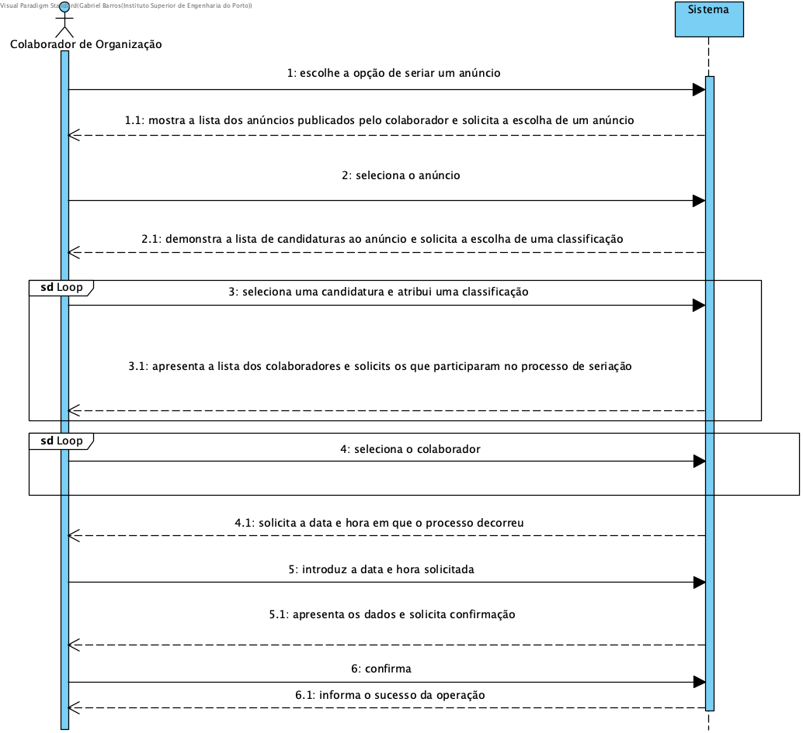
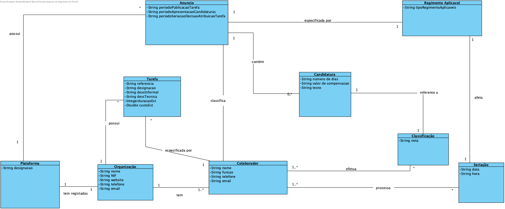
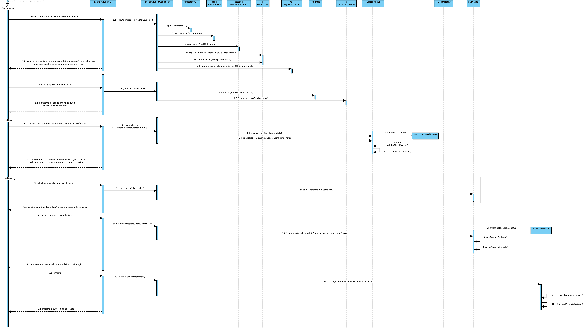
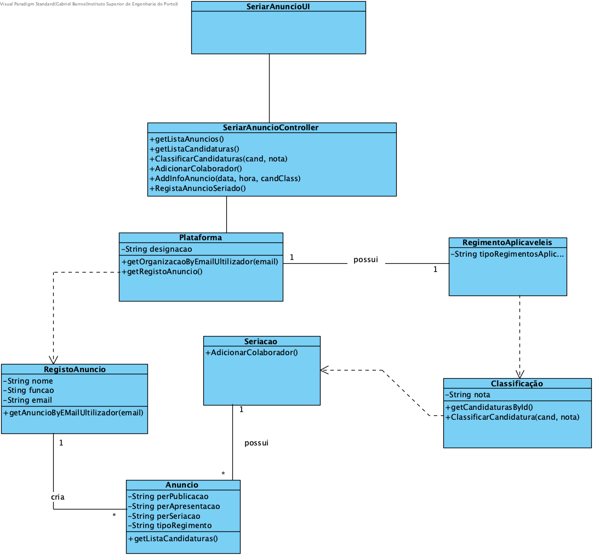

# UC10 - Seriar Anúncio

## 1. Engenharia de Requisitos

### Formato Breve
O colaborador de organização escolhe a opção de seriar um anúncio. O sistema demonstra a lista dos anúncios publicados pelo colaborador de organização, e solicita a escolha de um anúncio. O colaborador da organização seleciona o anuncio requerido. O sistema demonstra a lista de candidaturas ao anúncio e solicita a escolha de uma classificação. O colaborador seleciona uma candidatura e atribui uma classificação. O sistema apresenta a lista dos colaboradores e solicita os que participaram no processo de seriação. O colaborador seleciona o colaborador. O sistema solicita a data e hora em que o processo decorreu. O colaborador introduz. O sistema apresenta os dados e solicita confirmação. O colaborador confirma. O sistema informa do sucesso da operação.

### SSD

### Formato Completo

#### Ator principal

* Colaborador da organização

#### Partes interessadas e seus interesses
* **Colaborador da organização:** pretende seriar um anúncio anteriormente criado no sistema.
* **Freelancer:** pretende saber a tarefa para a qual vai trabalhar.
* **Organização:** pretende escolher um bom freelancer para a seu anúncio.
* **T4J:** pretende que os anúncios estejam ordenados para a atribuição da tarefa.

#### Pré-condições
Os anúncios estarem anteriormente criados no sistema.

#### Pós-condições
O sistema fica com os anúncios classificados, para depois prosseguir com a atribuição

### Cenário de sucesso principal (ou fluxo básico)

1. O colaborador de organização escolhe a opção de seriar um anúncio.
2. O sistema demonstra a lista dos anúncios publicados pelo colaborador de organização, e solicita a escolha de um anúncio.
3. O colaborador da organização seleciona o anuncio requerido.
4. O sistema demonstra a lista de candidaturas ao anúncio e solicita a escolha de uma classificação.
5. O colaborador seleciona uma candidatura e atribui uma classificação.
6. O sistema apresenta a lista dos colaboradores e solicita os que participaram no processo de seriação.
7. O passo 5 e 6 repetem-se até o colaborador não ter mais candidatura para selecionar.
8. O colaborador seleciona o colaborador.
9. O passo 8, repete-se até não ter mais colaborador para selecionar.
10. O sistema solicita a data e hora em que o processo decorreu.
11. O colaborador introduz.
12. O sistema apresenta os dados e solicita confirmação.
13. O colaborador confirma.
14. O sistema informa do sucesso da operação.

#### Extensões (ou fluxos alternativos)

*a. O colaborador da organização solicita o cancelamento da seriação de um anuncio.
> O caso de uso termina.

2a. Não existem anúncios definidas no sistema.
>1. O sistema informa o colaborador da organização de tal facto.
>2. O sistema permite a criação de um novo anuncio.
> 2a. O colaborador da organização não cria uma anuncio. O caso de uso termina.

6a. Dados mínimos obrigatórios em falta.
>	1. O sistema informa quais os dados em falta.
>	2. O sistema permite a introdução dos dados em falta (passo 3).
> 2a. O colaborador da organização não introduz os dados em falta. O caso de uso termina.

6b. O sistema deteta que os dados introduzidos (ou algum subconjunto dos dados) são inválidos.
> 1. O sistema alerta o colaborador da organização para o facto.
> 2. O sistema permite a sua alteração (passo 3)..
> 2a. O colaborador da organização não altera os dados. O caso de uso termina.

#### Requisitos especiais
\-

#### Lista de Variações de Tecnologias e Dados
\-

#### Frequência de Ocorrência
\-

#### Questões em aberto

* Existem outros dados que são necessários?
* Todos os dados são obrigatórios?
* Qual a frequência de ocorrência deste caso de uso?
* O período de seriação da tarefa na plataforma é inserido como datas ou em número de dias?

## 2. Análise OO

### Excerto do Modelo de Domínio Relevante para o UC

## 3. Design - Realização do Caso de Uso

### Racional

| Fluxo Principal | Questão: Que Classe... | Resposta  | Justificação  |
|:--------------  |:---------------------- |:----------|:---------------------------- |
|1.O colaborador de organização escolhe a opção de seriar um anúncio.|... interage com o utilizador?|SeriarAnuncioUI | Pure Fabrication, pois não se justifica atribuir esta responsabilidade a nenhuma classe existente no Modelo de Domínio.|
||... coordena o UC? |SeriarAnuncioController |Controller |
|2. O sistema demonstra a lista dos anúncios publicados pelo colaborador de organização, e solicita a escolha de um anúncio.||||
|3. O colaborador da organização seleciona o anuncio requerido|... conhece a lista de anuncio? |Plataforma |IE: no MD a Plataforma possui todas as instâncias de Anúncio. |
|4. O sistema demonstra a lista de candidaturas ao anúncio e solicita a escolha de uma classificação.|... conhece os regimentos aplicáveis?|Plataforma|IE: no MD a Plataforma possui todas as instâncias de RegimentoAplicavel|
||... valida os regimentos aplicáveis?|RegimentoAplicavel|IE: possui os seus próprios dados.|
|5. O colaborador seleciona uma candidatura e atribui uma classificação.|... guarda os dados introduzidos?|Classificação|Information Expert (IE) - instância criada no passo 1.|
| 6. O sistema apresenta a lista dos colaboradores e solicita os que participaram no processo de seriação.   		 |
| 7. O passo 5 e 6 repetem-se até o colaborador não ter mais candidatura para selecionar. | | |
| 8. O colaborador seleciona o colaborador.  		 |	... regista a seriação criado? | SeriarAnuncio | IE: Seria os anuncios na plataforma. |
|  |	... guarda a lista de seriação criado? | Plataforma  | IE: a Plataforma contém/agrega lista. |fl
| 9. O passo 8, repete-se até não ter mais colaborador para selecionar| | | | |
| 10. O sistema solicita a data e hora em que o processo decorreu.
|11. O colaborador introduz | ...guarda os dados introduzidos?|Seriação |Information Expert (IE) - instância criada no passo 1.|
|12. O sistema apresenta os dados e solicita confirmação.|...valida os dados da Seriação (validação local)|Seriação |IE. A Seriação possui os seus próprios dados.|
||...valida os dados da Seriação (validação global)|Classificação|IE: Classificação contém/agrega seriação.|
|13. O colaborador confirma.
|14. O sistema informa do sucesso da operação.  |	... regista a Seriação criada? | Seriação | HC e LC |
|  |	... guarda a Seriação criada? | Plataforma | IE: a Plataforma contém/agrega Seriação. |

### Sistematização ##

 Do racional resulta que as classes conceptuais promovidas a classes de software são:

 * Plataforma
 * Anuncio

Outras classes de software (i.e. Pure Fabrication) identificadas:

 * SeriarAnuncioUI
 * SeriarAnuncioController

 ###	Diagrama de Sequência

 

 ###	Diagrama de Classes

 
