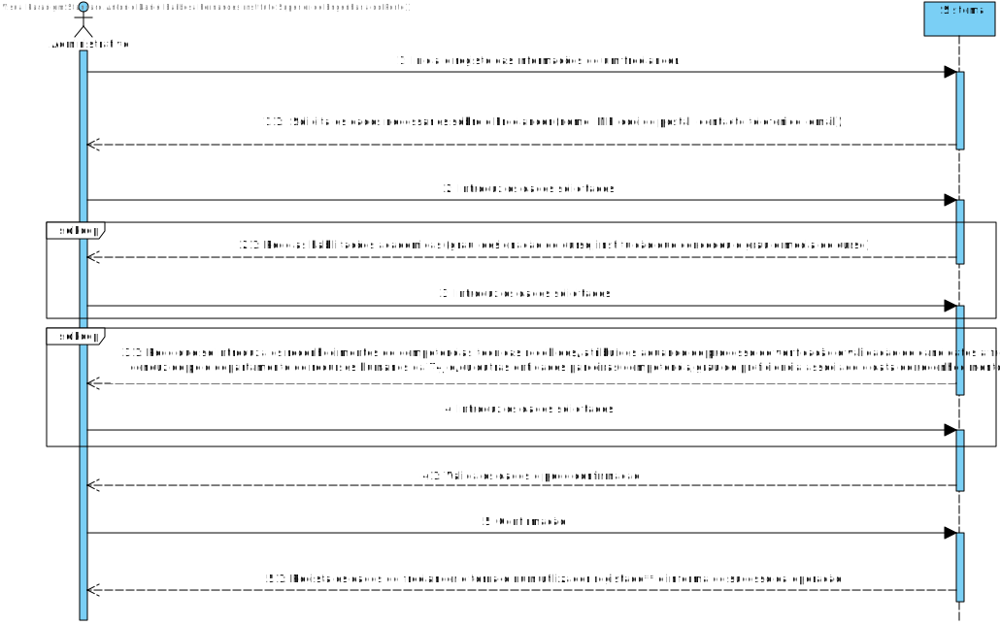
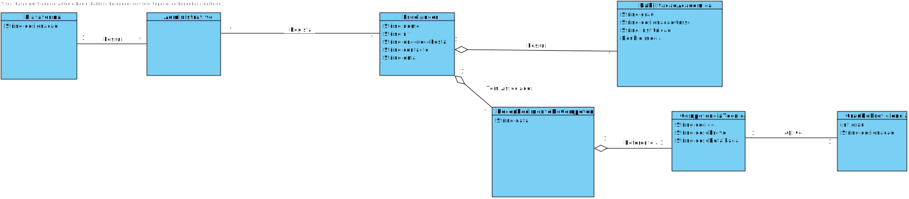
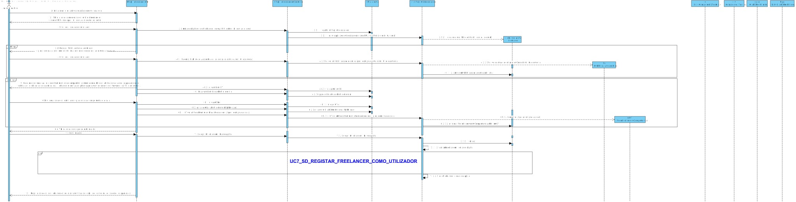
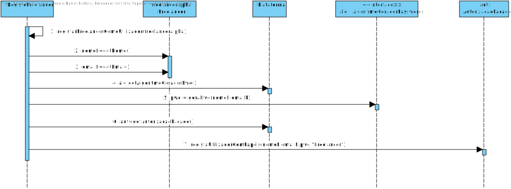
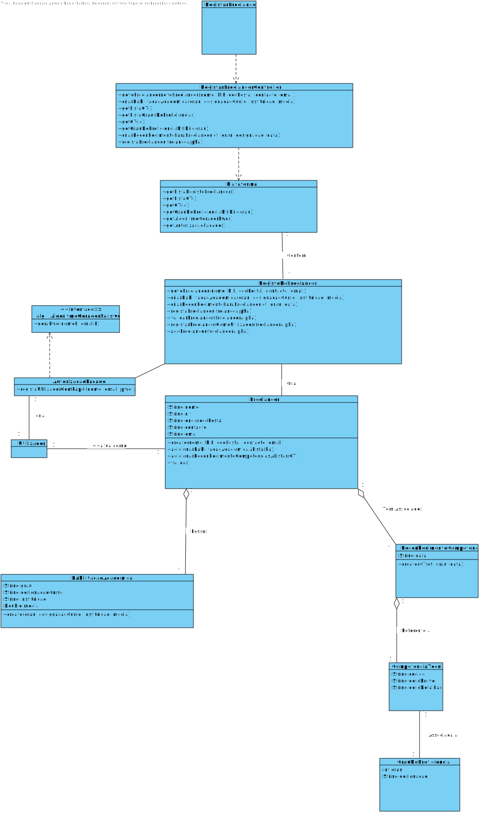

## 1. Engenharia de Requisitos

### Formato Breve

O Administrativo inicia o registo dos freelancers. O sistema pede os dados do freelancer (nome, NIF, código postal, contacto telefónico, email, habilitações académicas, e o reconhecimento de competências técnicas recebidos/ atribuídos. O Administrativo introduz os dados solicitados. O sistema pede a confirmação. O Administrativo confirma. O sistema valida os dados e informa do sucesso da operação.

### SSD

### Formato Completo

#### Ator principal

Administrativo

#### Partes interessadas e seus interesses

* **Administrativo:** pretende registar o freelancer na plataforma.
* **T4J:** pretende que o administrativo seja registado de modo a puder usar a plataforma.
* **Freelancer:** Após o caso de uso este terá acesso à plataforma.

#### Pré-condições
n/a

#### Pós-condições
A informação do registo do freelancer é guardada no sistema.

#### Cenário de sucesso principal (ou fluxo básico)

1. O Administrativo inicia o registo das informações de um freelancer.
2. O sistema solicita os dados necessários sobre o Freelancer (nome, NIF, código postal, contacto telefónico, email).
3. O Administrativo introduz os dados solicitados.
4. O sistema pede as habilitações académicas	(grau, designação do curso, instituição que concedeu o grau e média de curso).
5. O Administrativo introduz os dados solicitados.
6. O passo 4 e 5 repetem-se até o administrativo não ter mais habilitações para introduzir.
7. O sistema pede ao Administrativo que introduza os reconhecimentos de competências técnicas recebidos/ atribuídos aquando do processo de verificação e validação de candidatos a freelancers conduzido pelo departamento de recursos humanos da T4J e/ou outras entidades parceiras (data,grau de proficiência e competência associada a essa data e grau).
8. O Administrativo introduz os dados solicitados.
9.  O passo 7 e 8 repetem-se até o administrativo não ter mais habilitações para introduzir.
10. O sistema valida e apresenta os dados, pedindo que os confirme.
11. O Administrativo confirma.
12. O sistema **regista os dados do freelancer e tornando este um utilizador registado (gera a password)** e informa o Administrativo do sucesso da operação.

#### Extensões (ou fluxos alternativos)

*a. O Administrativo solicita o cancelamento do registo.

> O caso de uso termina.

4a. Dados incompletos.
>	1. O sistema informa quais os dados em falta.
>	2. O sistema permite a introdução dos dados em falta (passo 3)
>
	>	2a. O Administrativo não altera os dados. O caso de uso termina.

4b. Dados mínimos obrigatórios em falta.
>	1. O sistema informa quais os dados em falta.
>	2. O sistema permite a introdução dos dados em falta (passo 3)
>
	>	2a. O Administrativo não altera os dados. O caso de uso termina.

4c. O sistema deteta que os dados (ou algum subconjunto dos dados) introduzidos devem ser únicos e que já existem no sistema.
>	1. O sistema alerta o Administrativo para o facto.
>	2. O sistema permite a sua alteração (passo 3)
>
	>	2a. O Administrativo não altera os dados. O caso de uso termina.

6a. Dados incompletos.
>	1. O sistema informa quais os dados em falta.
>	2. O sistema permite a introdução dos dados em falta (passo 5)
>
	>	2a. O Administrativo não altera os dados. O caso de uso termina.

6b. Dados mínimos obrigatórios em falta.
>	1. O sistema informa quais os dados em falta.
>	2. O sistema permite a introdução dos dados em falta (passo 5)
>
	>	2a. O Administrativo não altera os dados. O caso de uso termina.

6c. O sistema deteta que os dados (ou algum subconjunto dos dados) introduzidos devem ser únicos e que já existem no sistema.
>	1. O sistema alerta o Administrativo para o facto.
>	2. O sistema permite a sua alteração (passo 5)
>
	>	2a. O Administrativo não altera os dados. O caso de uso termina.

9a. Dados incompletos.
>	1. O sistema informa quais os dados em falta.
>	2. O sistema permite a introdução dos dados em falta (passo 8)
>
	>	2a. O Administrativo não altera os dados. O caso de uso termina.

9b. Dados mínimos obrigatórios em falta.
>	1. O sistema informa quais os dados em falta.
>	2. O sistema permite a introdução dos dados em falta (passo 8)
>
	>	2a. O Administrativo não altera os dados. O caso de uso termina.

9c. O sistema deteta que os dados (ou algum subconjunto dos dados) introduzidos devem ser únicos e que já existem no sistema.
>	1. O sistema alerta o Administrativo para o facto.
>	2. O sistema permite a sua alteração (passo 8)
>
	>	2a. O Administrativo não altera os dados. O caso de uso termina.

#### Requisitos especiais
\-

#### Lista de Variações de Tecnologias e Dados
\-Algoritmo de gerar password

#### Frequência de Ocorrência
\-

#### Questões em aberto

* Como devem ser inseridos os reconhecimentos?? Algum pdf??

## 2. Análise OO

### Excerto do Modelo de Domínio Relevante para o UC

## 3. Design - Realização do Caso de Uso

### Racional

| Fluxo Principal | Questão: Que Classe... | Resposta  | Justificação  |
|:--------------  |:---------------------- |:----------|:---------------------------- |
|1.O Administrativo inicia o registo das informações de um freelancer.|... interage com o utilizador?|RegistarFreelancerUI | Pure Fabrication, pois não se justifica atribuir esta responsabilidade a nenhuma classe existente no Modelo de Domínio.|
||... coordena o UC?|RegistarFreelancerController|Controller|
||... cria instância do Freelancer?|RegistoFreelancer|Creator (Regra1)|
|2. O sistema solicita os dados necessários sobre o Freelancer (nome, NIF, código postal, contacto telefónico, email).||||
|3. O Administrativo introduz os dados solicitados.|... guarda os dados introduzidos?|Freelancer|Information Expert (IE) - instância criada no passo 1.|
|4. O sistema pede as habilitações académicas	(grau, designação do curso, instituição que concedeu o grau e média de curso).||||
|5. O Administrativo introduz os dados solicitados.|... guarda os dados|HabilitacaoAcademica|IE: No MD uma HabilitacaoAcademica é referente a um Freelancer.|
|6. O passo 4 e 5 repetem-se até o administrativo não ter mais habilitações académicas para introduzir.||||
|7. O sistema pede ao Administrativo que introduza os reconhecimentos de competências técnicas recebidos/ atribuídos aquando do processo de verificação e validação de candidatos a freelancers conduzido pelo departamento de recursos humanos da T4J e/ou outras entidades parceiras(data,grau de proficiência e competência associada a essa data e grau).||||
|8. O Administrativo introduz os dados solicitados.|... guarda os dados|ReconhecimentoDeCompetências|No MD uma ReconhecimentoDeCompetencias é referente a um Freelancer.|
|9.  O passo 7 e 8 repetem-se até o administrativo não ter mais reconhecimentos de competências para introduzir.||||
|10. O sistema valida e apresenta os dados, pedindo que os confirme.|...valida os dados do Freelancer (validação local)|Freelancer|IE. O Freelancer possui os seus próprios dados.|
||...valida os dados do Freelancer (validação global)|RegistoFreelancer|IE: RegistoFreelancer contém a lista de todos o Freelancer.|
|11. O Administrativo confirma.||||
|12. O sistema regista os dados do freelancer e tornando este um utilizador registado (gera a password) e informa o Administrativo do sucesso da operação.|... guarda o Freelancer criado?|RegistoFreelancer|	HC e LC: Regra 2: Quando uma lista de Freelancer é do sistema denomina-se RegistoFreelancer|
||... gera a password?|**classe que implemente a interface ** *AlgoritmoGeradorPasswords* **|Protected Variation:a implementação desta forma fará com que se evite problemas de variação no algoritmo externo que será implementado.|
|	| ... regista/guarda o Utilizador referente ao Colaborador? | AutorizacaoFacade  | IE: a gestão de utilizadores é responsabilidade do componente externo respetivo, cujo ponto de interação é através da classe "AutorizacaoFacade".|

### Sistematização ##

 Do racional resulta que as classes conceptuais promovidas a classes de software são:

 * Plataforma
 * Freelancer
 * RegistoFreelancer

Outras classes de software (i.e. Pure Fabrication) identificadas:  

 * RegistarFreelancerUI  
 * RegistarFreelancerController

###	Diagrama de Sequência

**Registar Freelancer como Utilizador ->REFERÊNCIA:**

###	Diagrama de Classes

