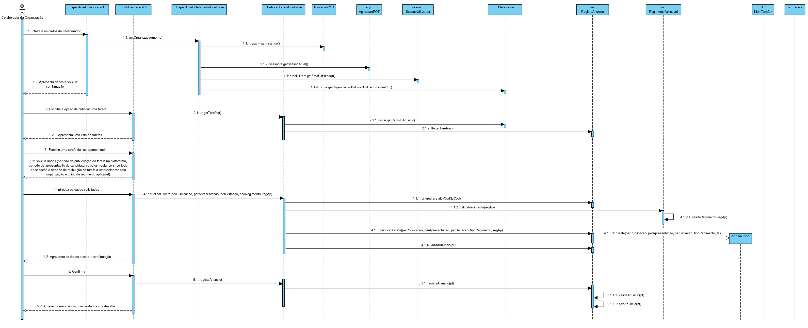

# UC8 - Publicar Tarefa

## 1. Engenharia de Requisitos

### Formato Breve

O colaborador de organização escolhe a opção de publicar uma tarefa. O sistema demonstra a lista das tarefas criadas pelo colaborador de organização. O colaborador de organização escolhe a tarefa da lista. O sistema solicita os dados necessários (i.e. período de publicitação da tarefa na plataforma, período de apresentação de candidaturas pelos freelancers, período de seriação e decisão de atribuição da tarefa a um freelancer pela organização e o tipo de regimento aplicável). O colaborador da organização introduz os dados solicitados. O sistema valida e apresenta os dados ao colaborador da organização, pedindo que os confirme. O colaborador da organização confirma. A plataforma apresenta um anúncio com os dados introduzidos pelo colaborador da organização.

### SSD

### Formato Completo

#### Ator principal

* Colaborador da organização

#### Partes interessadas e seus interesses
* **Colaborador da organização:** pretende publicar uma tarefa anteriormente criada no sistema.
* **Freelancer:** pretende saber e escolher a tarefa para a qual quer concorrer.
* **Organização:** pretende ter disponíveis as tarefas como forma de anúncio para mais fácil adesão dos freelancers.
* **T4J:** pretende que as tarefas estejam disponíveis para os freelancers.

#### Pré-condições
* Tem de ser anteriormente criada uma tarefa para que possa ser publicada.

#### Pós-condições
* O sistema fica com um anúncio da tarefa publicada.

### Cenário de sucesso principal (ou fluxo básico)

1. O colaborador de organização escolhe a opção de publicar uma tarefa.
2. O sistema mostra a lista de tarefas do colaborador de organização.
3. O colaborador de organização escolhe a tarefa da lista.
4. O sistema solicita os dados necessários (i.e. período de publicitação da tarefa na plataforma, período de apresentação de candidaturas pelos freelancers, período de seriação e decisão de atribuição da tarefa a um freelancer pela organização e o tipo de regimento aplicável).
5. O colaborador da organização introduz os dados solicitados.
6. O sistema apresenta os dados ao colaborador da organização, pedindo que os confirme.
7. O colaborador da organização confirma.
8. O sistema gera o anúncio e informa o Colaborador da organização do sucesso da operação.

#### Extensões (ou fluxos alternativos)

*a. O colaborador da organização solicita o cancelamento da publicação de uma tarefa.  
> O caso de uso termina.

2a. Não existem tarefas definidas no sistema.  
>1. O sistema informa o colaborador da organização de tal facto.  
>2. O sistema permite a criação de uma nova tarefa (UC6).  
> 2a. O colaborador da organização não cria uma tarefa. O caso de uso termina.

6a. Dados mínimos obrigatórios em falta.
>	1. O sistema informa quais os dados em falta.
>	2. O sistema permite a introdução dos dados em falta (passo 3).  
> 2a. O colaborador da organização não introduz os dados em falta. O caso de uso termina.

6b. O sistema deteta que os dados introduzidos (ou algum subconjunto dos dados) são inválidos.
> 1. O sistema alerta o colaborador da organização para o facto.
> 2. O sistema permite a sua alteração (passo 3)..  
> 2a. O colaborador da organização não altera os dados. O caso de uso termina.

#### Requisitos especiais
\-

#### Lista de Variações de Tecnologias e Dados
\-

#### Frequência de Ocorrência
\-

#### Questões em aberto

* Existem outros dados que são necessários?
* Todos os dados são obrigatórios?
* Qual a frequência de ocorrência deste caso de uso?
* O período de publicitação da tarefa na plataforma é inserido como datas ou em número de dias?
****

## 2. Análise OO

### Excerto do Modelo de Domínio Relevante para o UC

****

## 3. Design - Realização do Caso de Uso

### Racional

| Fluxo Principal | Questão: Que Classe... | Resposta  | Justificação  |
|:--------------  |:---------------------- |:----------|:---------------------------- |
|1.O colaborador da organização inicia  a publicação de uma tarefa.|... interage com o utilizador?|PublicarTarefaUI | Pure Fabrication, pois não se justifica atribuir esta responsabilidade a nenhuma classe existente no Modelo de Domínio.|
||... coordena o UC? |PublicarTarefaController |Controller |
||... cria a instância de Anuncio? |RegistoAnuncio |RegistoAnuncio (Regra1) |
|2. O sistema mostra a lista de tarefas do colaborador de organização.||||
|3. O colaborador de organização escolhe a tarefa da lista.|... conhece a lista de tarefas? |Plataforma |IE: no MD a Plataforma possui todas as instâncias de Tarefa. |
|4. O sistema solicita os dados necessários (i.e. período de publicitação da tarefa na plataforma, período de apresentação de candidaturas pelos freelancers, período de seriação e decisão de atribuição da tarefa a um freelancer pela organização e o tipo de regimento aplicável).|... conhece os regimentos aplicáveis?|Plataforma|IE: no MD a Plataforma possui todas as instâncias de RegimentoAplicavel|
||... valida os regimentos aplicáveis?|RegimentoAplicavel|IE: possui os seus próprios dados.|
|5. O colaborador da organização introduz os dados solicitados.|... guarda os dados introduzidos?|Anuncio |Information Expert (IE) - instância criada no passo 1.|
| 6. O sistema valida e apresenta os dados ao colaborador da organização, pedindo que os confirme.   		 |	... valida os dados do Anuncio (validação local)? | Anuncio | IE: possui os seus próprios dados.|  	
|	 |	... valida os dados do Anuncio (validação global)? | Tarefa  | IE: a Tarefa contém/agrega Anuncio.  |
| 7. O colaborador da organização confirma os dados.   		 |							 |             |                              |
| 8. O sistema regista os dados e informa o colaborador da organização do sucesso da operação.  		 |	... regista o Anuncio criado? | RegistoAnuncio  | HC e LC |
|  |	... guarda o Anuncio criado? | Plataforma  | IE: a Plataforma contém/agrega Anuncio. |

### Sistematização ##

 Do racional resulta que as classes conceptuais promovidas a classes de software são:

 * Plataforma
 * Anuncio
 * RegimentoAplicavel

Outras classes de software (i.e. Pure Fabrication) identificadas:  

 * PublicarTarefaUI
 * PublicarTarefaController

 ###	Diagrama de Sequência

 

 ###	Diagrama de Classes

 
