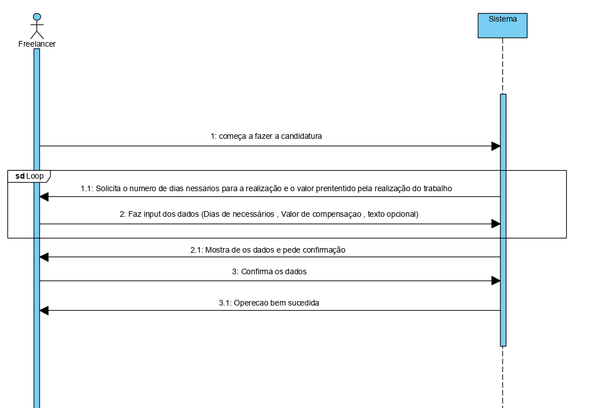

# UC9 Efetuar a candidatura

### Formato Breve

Quanto o freelancer  candidatar-se a	 um	 anúncio	 para	 o	 qual	 é	 elegível,
isto	é, quando	lhe	é	reconhecido	possuir	o	grau	de	proficiência	mínimo	exigido	a
todas	as	 competências	 técnicas	 obrigatórias	 para	a tarefa	em	 causa. Ao	efetuar
uma	 candidatura,	 este	 deve	 obrigatoriamente	 indicar	 o	 valor	 pretendido	 pela
realização	da	tarefa	bem	com	o	número	de	dias	necessários	à	sua	realização	após
atribuição	 da	 mesma.	 Opcionalmente,	 pode	 incluir	 um	 texto	 de	 apresentação
e/ou	motivação.

### SSD

### Formato Completo

### Ator principal

Freelancer

### Partes interessadas e seus interesses

* **Freelancer** quer trabalho em troca de compensação

* **Colaborador da organização** quer tarefas realizadas por um freelancer com competências para o trabalho

### Pré condições
 O freelancer tem de ter as competências mínimas necessárias
### Pós condições
O freelancer efetua a candidatura

#### Cenário de sucesso principal (ou fluxo básico)
1. O freelancer começa a fazer a  candidatura
2. O sistema pede lhe os dados para a candidatura (numero de dias de necessários , valor de compensação e texto )
3. O freelancer faz a sua candidatura fazendo input dos dados necessário.
4. 4. O sistema valida e apresenta os dados, pedindo que os confirme.
5. o Freelancer confirma
6. O sistema regista a candidatura

#### Extensões (ou fluxos alternativos)

a. O freelancer não faz input dos Dados
> caso de uso termina

### Requisitos especiais
N/a
#### Lista de Variações de Tecnologias e Dados
\-

#### Frequência de Ocorrência
Sempre que um freelancer quer fazer candidatura

#### Questões em aberto

## 2. Análise OO

## 3. Design - Realização do Caso de Uso

### Racional

|Fluxo Principal | Questão que class? | Resposta | Justificação |
|:-------------- |:------------------ |:-------- |:------------------- |
| 1. O freelancer começa a fazer a  candidatura | ... interage com o utilizador? | FazercandidaturaUI | Pure Fabrication |
| | ... coordena o UC? | FazercandidaturaController | Controller
| | Cria as intâncias de candidatura ? | RegistarCanditura |Creator(regra1)
| 2. O sistema pede lhe os dados para a candidatura (numero de dias de necessários , valor de compensação e texto ) | | | |
|3. O freelancer faz a sua candidatura fazendo input dos dados necessário. |  guarda os dados introduzidos? | Candidatura| IE: instância criada no passo 1
|4.O sistema valida e apresenta os dados, pedindo que os confirme.| ... valida os dados da Candidatura (validação local)| Candidatura | IE: possui os seus próprios dados|
|5. O Freelancer registado confirma.|
|6. O sistema regista a candidatura | ... guarda a candidatura criada ?| RegistarCanditura  |HC e LC: Regra 2|  

### Sistematização ##

Do racional resulta que as classes conceptuais promovidas a classes de software são:

* Freelancer
* Candidatura

Outras classes de software (i.e. Pure Fabrication) identificadas:  

* FazercandidaturaUI
* FazercandidaturaControler

###	Diagrama de Sequência

###	Diagrama de Classes

