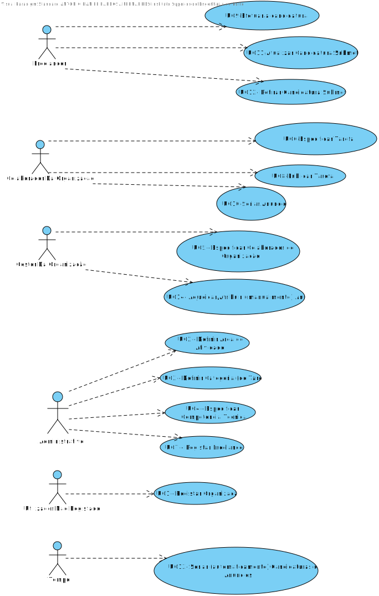

# Diagrama de Casos de Uso

**Para cada caso de uso deve ser realizada a sua descrição (perspetiva de engenharia de requisitos) e a sua realização (perspetiva de design).**

# Casos de Uso
| UC  | Descrição                                                               |                   
|:----|:------------------------------------------------------------------------|
| UC1 | [Registar Organização](UC1/UC1_RegistarOrganizacao.md)   |
| UC2 | [Definir Área de Atividade](UC2/UC2_DefinirArea.md)  |
| UC3 | [Definir Categoria (de Tarefa)](UC3/UC3_DefinirCategoria.md)|
| UC4 | [Especificar Competência Técnica](UC4/UC4_EspecificarCT.md)|
| UC5 | [Especificar Colaborador de Organização](UC5/UC5_EspecificarColaborador.md) |
| UC6 | [Especificar Tarefa](UC6/UC6_EspecificarTarefa.md)|
| UC7 | [Registar Freelancer](UC7/UC7_RegistarFreelancer.md)|
| UC8 | [Publicar Tarefa](UC8/UC8_PublicarTarefa.md)|
| UC9 | [Efetuar Candidatura](UC9/UC9_EfetuarCandidatura.md)|
| UC10 | [Seriar Anuncio](UC10/UC10_SeriarAnuncio.md)|
| UC11 | [Atualizar Candidatura Submetida](UC11/UC11_Atualizar_Candidatura_Submetida.md)|
| UC12 | [Retirar Candidatura Submetida](UC12/UC12_Retirar_Candidatura.md)|
| UC13 | [Seriar Candidaturas de Anúncios](UC13/UC13_SeriarCandidatura(Automaticamente).md)|
| UC14 | [Atribuir Anuncio](UC14/UC14_AtribuirAnuncio.md)|
