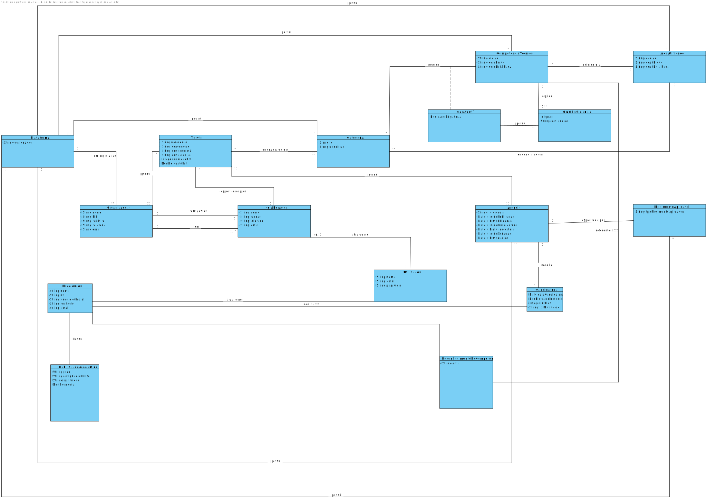

# Análise OO #
O processo de construção do modelo de domínio é baseado nos casos de uso, em especial os substantivos utilizados, e na descrição do enunciado.
## Racional para identificação de classes de domínio ##
Para a identificação de classes de domínio usa-se a lista de categorias das aulas TP (sugeridas no livro). Como resultado temos a seguinte tabela de conceitos (ou classes, mas não de software) por categoria.

### _Lista de Categorias_ ###

**Transações (do negócio)**

* __Anúncio__
* __Processo de Seriação__
* __Candidatura__

---

**Linhas de transações**

* __Classificacao__

---

**Produtos ou serviços relacionados com transações**

*  Tarefa

---

**Registos (de transações)**

*

---  

**Papéis das pessoas**

* Administrativo
* Freelancer
* Colaborador (de Organização)
* Gestor (de Organização)
* Utilizador
* Utilizador Não Registado

---

**Lugares**

*  Endereço Postal
*  Plataforma

---

**Eventos**

* __Processo de Seriação__
* __Candidatura__

---

**Objectos físicos**

*

---

**Especificações e descrições**

*  Área de Atividade
*  Competência Técnica
*  Categoria (de Tarefa)
*  Tarefa
*  __Tipo Regimento__
*  __Grau Proficiência__
*  __Habilitação Académica__
*  __Reconhecimento de Competência Técnica__
---

**Catálogos**

*

---

**Conjuntos**

* Lista de Competência Técnica Requeridas

---

**Elementos de Conjuntos**

*  Caráter de Competência Técnica Requerida

---

**Organizações**

*  T4J (Plataforma)
*  Organização

---

**Outros sistemas (externos)**

*  (Componente Gestão Utilizadores)
*  Algoritmo (Externo) Gerador de Passwords

---

**Registos (financeiros), de trabalho, contractos, documentos legais**

*  __Tipo Regimento__

---

**Instrumentos financeiros**

*

---

**Documentos referidos/para executar as tarefas/**

*

---

## **Racional sobre identificação de associações entre classes** ##

Uma associação é uma relação entre instâncias de objetos que indica uma conexão relevante e que vale a pena recordar, ou é derivável da Lista de Associações Comuns:

+ A é fisicamente (ou logicamente) parte de B
+ A está fisicamente (ou logicamente) contido em B
+ A é uma descrição de B
+ A é conhecido/capturado/registado por B
+ A usa ou gere B
+ A está relacionado com uma transação de B
+ etc.

| Conceito (A) 		|  Associação   		|  Conceito (B) |
|----------	   		|:-------------:		|------:       |
| Administrativo  	| define    		 	| Área de Atividade  |
|   					| define            | Competência Técnica  |
|   					| trabalha para     | Plataforma  |
|						| atua como			| Utilizador |
| Plataforma			| tem registadas    | Organização  |
|						| tem/usa    			| Freelancer  |
|						| tem     			| Administrativo  |
| 						| possui     			| Competência Técnica  |
| 						| possui     			| Área de Atividade  |
| 						| possui     			| Categoria (de Tarefa)  |
|                       | recorre a         | Algoritmo (Externo) Gerador Passwords |
|                       | publicita         | Anuncio   |
|                       | suporta           | Tipo de Regimento|
| Competência Técnica| referente a       | Área de Atividade  |
|                    | aplica            | Grau Proficiência|
| Categoria (de Tarefa)| enquadra-se em | Área de Atividade  |
|						| tem 					| Lista de Competência Técnica Requeridas
| Lista de Competência Técnica Requeridas | tem | Caráter de Competência Técnica Requerida
| Caráter de Competência Técnica Requerida |  é referente a | Competência Técnica
|                                          | exige (como minimo)| Grau de Proficiência|
| Organização			| localizada em 	   | Endereço Postal  |
|						| tem gestor     	| Colaborador |
|						| tem		     		| Colaborador |
|						| possui		     	| Tarefa |
| Tarefa		    	| enquadra-se	em 		| Categoria |
| Tarefa		    	| especificada por 	| Colaborador |
|                       | dá origem         | Anuncio  |
| Anuncio               | publicita         | Tarefa |
|                       | rege-se           | Tipo de Regimento|
|                       | espoleta          | Processo de Seriação|
|                       | possui           | Candidatura|
|                       | publicado           | Colaborador|
| Processo de Seriação  | decorre em concordância com | Tipo de Regimento|
|                       | resulta            | Classificacao|
|                       | realizado por      | Colaborador|
| Classificacao         | referente a        | Candidatura|
| Candidatura           | realizado por       | Freelancer|
|                       | tem/recebe          | Classificacao|
| Gestor (de Organização)| é um (papel de)| Colaborador |
||realiza|processo de atribuição|
| Freelancer		| atua como	    | Utilizador |
|                       | tem               | Habilitação Académica|
|                       | recebe(u)         | Reconhecimento de Competência Técnica |
|                       | tem               | Endereço Postal| 
|                       | efetua            | Candidatura|
|                       | atualiza a        |Candidatura|
|                       | remove a          |Candidatura|
|                       | tem               | Endereço Postal|
|                       | efetua            | Candidatura|
|Reconhecimento de Competência Técnica| relativo a| Competência Técnica|
|                                     | reconhece| Grau Proficiência|
| Colaborador		| atua como			| Utilizador |
|                       | participa em      | Processo de Seriacao|
| Algoritmo (Externo) Gerador Passwords | gera password de | Utilizador |
|Sistema| efetua| Seriação Automática|

## Modelo de Domínio

