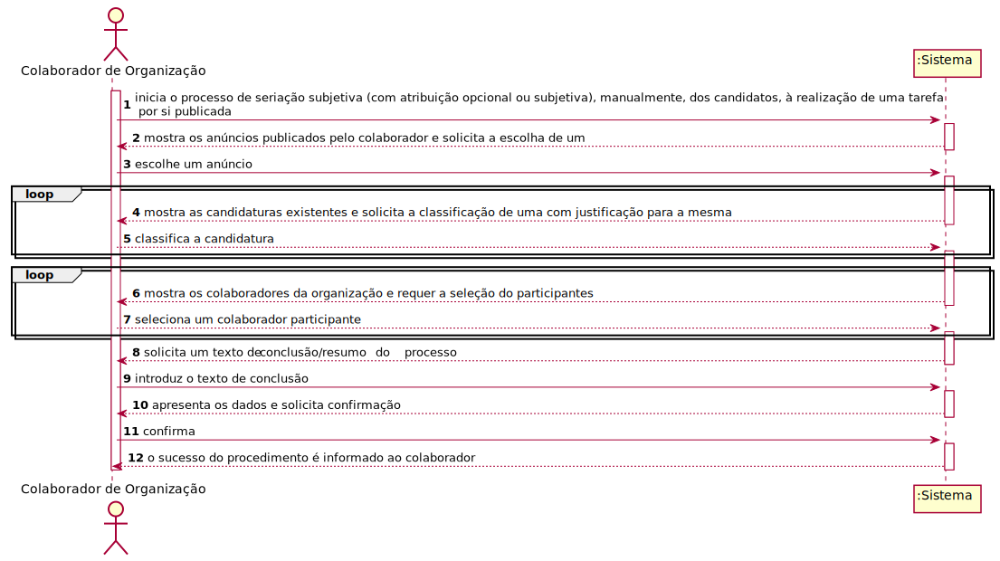
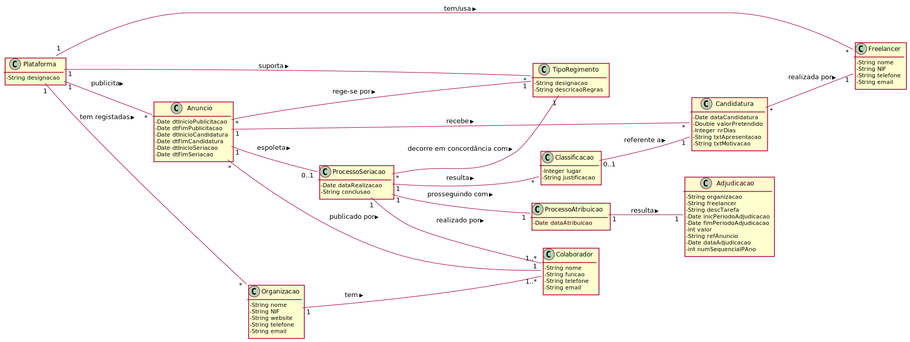
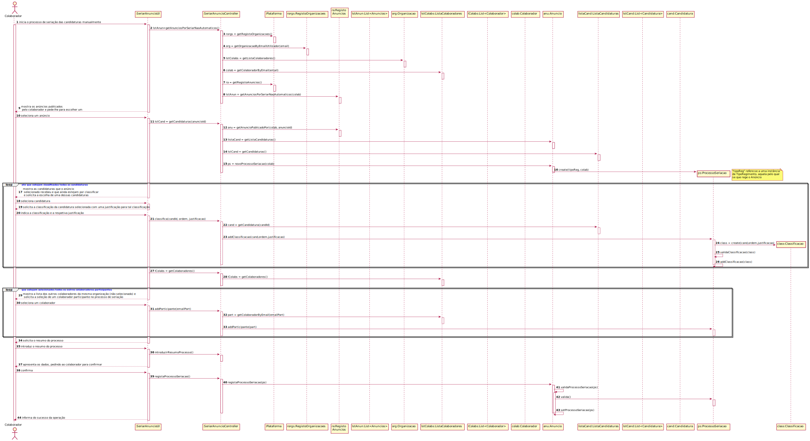
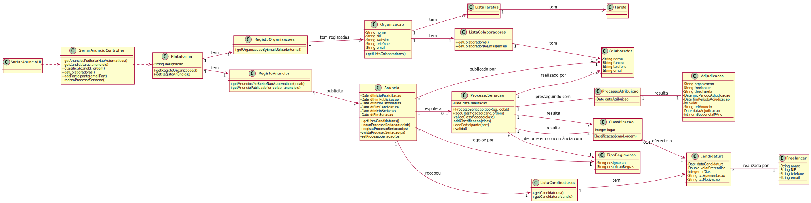

# UC 10 - Seriar (Não Automaticamente) Candidaturas de Anúncio

## 1. Engenharia de Requisitos

### Formato Breve

O colaborador de organização inicia o processo de seriação subjetiva com atribuição opcional ou subjetiva, manualmente, dos candidatos, à realização de uma tarefa por si publicada. O sistema mostra ao colaborador os anúncios publicados pelo mesmo e solicita a escolha de um, escolhendo-o então o colaborador, posteriormente. O sistema mostra as candidaturas existentes a esse anúncio e solicita a classificação das mesmas, com uma justificação para essa tal classificação. O colaborador trata das classificações, dando uma justificação para cada. O sistema mostra a lista dos restantes colaboradores e requer a escolha dos participantes. O colaborador introduz os restantes colaboradores participantes. O sistema solicita um texto de resumo do processo de seriação, o qual é introduzido pelo colaborador. O sistema apresenta os dados e solicita confirmação. O colaborador confirma. O sistema informa então o sucesso da operação.

### SSD

### Formato Completo

#### Ator principal

* Colaborador de Organização

#### Partes interessadas e seus interesses

* **Colaborador de Organização:** pretende seriar as candidaturas que um anúncio recebeu.
* **Freelancer:** pretende conhecer a classificação das suas candidaturas à realização de determinados anúncios publicados na plataforma.
* **Organização:** pretende contratar pessoas externas (outsourcing) para a realização de determinadas tarefas e com competências técnicas apropriadas.
* **T4J:** pretende satisfazer as organizações e os freelancer facilitando a contratação de freelancers pelas organizações e vice-versa.

#### Pré-condições

* Existir pelo menos um anúncio de tarefa em condições de ser seriado manualmente pelo colaborador ativo no sistema.

#### Pós-condições
* A informação do processo de seriação é registada no sistema.

#### Cenário de sucesso principal (ou fluxo básico)

1. inicia o processo de seriação subjetiva (com atribuição opcional ou subjetiva), manualmente, dos candidatos à realização de uma tarefa por si publicada.
2. O sistema mostra mostra os anúncios publicados pelo colaborador.
3. O colaborador seleciona um anúncio.
4. O sistema mostra as candidaturas existentes e solicita a classificação de uma com justificação para a mesma.
5. O colaborador classifica a candidatura.
6. Os passos 4 e 5 repetem-se até que estejam classificadas todas as candidaturas.
7. O sistema mostra os colaboradores da organização e requer a seleção do participantes.
8. O colaborador seleciona outro colaborador participante.
9. Os passos 7 e 8 repetem-se até que estejam selecionados todos os colaboradores participantes.
10. O sistema solicita um texto de conclusão/resumo do processo.
11. O colaborador introduz o texto de conclusão.
12. O sistema valida e apresenta os dados, pedindo ao colaborador para confirmar.
13. O colaborador confirma.
14. O sistema informa ao colaborador o sucesso da operação.

#### Extensões (ou fluxos alternativos)

*a. O colaborador solicita o cancelamento do processo de seriação das candidaturas.
> O caso de uso termina.

12a. Dados mínimos obrigatórios em falta.
>	1. O sistema informa quais os dados em falta.
>	2. O sistema permite a introdução dos dados em falta (passo 2)
>
	> 2a. O colaborador não altera os dados. O caso de uso termina.

#### Requisitos especiais

\-

#### Lista de Variações de Tecnologias e Dados

\-

#### Frequência de Ocorrência

\-

#### Questões em aberto

* O mesmo lugar/classificação pode ser atribuído a mais do que uma candidatura (e.g. em caso de empate)?
* O processo de seriação pode ser concluído havendo candidaturas por classificar?
* Há algum motivo que possa levar à desclassificação de uma candidatura?

## 2. Análise OO

### Excerto do Modelo de Domínio Relevante para o UC

## 3. Design - Realização do Caso de Uso

### Racional

| Fluxo Principal | Questão: Que Classe... | Resposta  | Justificação  |
|:--------------  |:---------------------- |:----------|:---------------------------- |
|1. inicia o processo de seriação subjetiva (com atribuição opcional ou subjetiva), manualmente, dos candidatos à realização de uma tarefa por si publicada.|... interage com o utilizador?|PublicarTarefaUI|Pure Fabrication|
|  		 |	... coordena o UC?	| SeriarAnuncioController | Controller    |
| |...conhece o utilizador/gestor a usar o sistema?|SessaoUtilizador|IE: cf. documentação do componente de gestão de utilizadores.|
| |...sabe a que organização o utilizador/colaborador pertence?|RegistoOrganizacoes|IE: conhece todas as organizações.|
| ||Organização|IE: conhece os seus colaboradores.|
| |...conhece o RegistoOrganizacoes?|Plataforma|IE: Plataforma tem RegistoOrganizacoes|
|2. O sistema mostra os anúncios publicados pelo colaborador||||
|3. O colaborador seleciona um anúncio.|... conhece a lista de anuncio? |Plataforma |IE: no MD a Plataforma possui todas as instâncias de Anúncio. |
|4. O sistema mostra as candidaturas existentes e solicita a classificação de uma com justificação para a mesma.|... conhece os regimentos aplicáveis?|Plataforma|IE: no MD a Plataforma possui todas as instâncias de RegimentoAplicavel|
||... valida os regimentos aplicáveis?|RegimentoAplicavel|IE: possui os seus próprios dados.|
|5. O colaborador classifica a candidatura.|... guarda os dados introduzidos?|Classificação|Information Expert (IE) - instância criada no passo 1.|
| 6. Os passos 4 e 5 repetem-se até que estejam classificadas todas as candidaturas.   		 |
| 7. O sistema mostra os colaboradores da organização e requer a seleção do participantes.| | |
| 8. O colaborador seleciona o colaborador.  		 |	... regista a seriação criado? | SeriarAnuncio | IE: Seria os anuncios na plataforma. |
|  |	... guarda a lista de seriação criado? | Plataforma  | IE: a Plataforma contém/agrega lista. |fl
|9. Os passos 7 e 8 repetem-se até que estejam selecionados todos os colaboradores participantes.| | | | |
|10.O sistema solicita um texto de conclusão/resumo do processo
|11. O colaborador introduz o texto de conclusão | ...guarda os dados introduzidos?|ProcessoSeriacao |Information Expert (IE) - instância criada no passo 1.|
|12. O sistema valida e apresenta os dados, pedindo ao colaborador para confirmar.|...valida os dados da Seriação (validação local)|ProcessoSeriacao |IE. A Seriação possui os seus próprios dados.|
||...valida os dados da Seriação (validação global)|Classificação|IE: Classificação contém/agrega seriação.|
|13. O colaborador confirma.
|14. O sistema informa do sucesso da operação.  |	... |...guarda a seriacao?| ProcessoSeriacao|IE|
| |...informa o colaborador?|SeriarAnuncioUI|

### Sistematização ##

 Do racional resulta que as classes conceptuais promovidas a classes de software são:

 * Plataforma
 * Anuncio
 * Candidatura
 * ProcessoSeriacao
 * TipoRegimento
 * Classificacao
 * Organizacao
 * Colaborador
 * ProcessoAtribuicao
 * Adjudicacao

Outras classes de software (i.e. Pure Fabrication) identificadas:  

 * SeriarAnuncioUI  
 * SeriarAnuncioController
 * RegistoAnuncios
 * RegistoOrganizacoes
 * ListaColaboradores
 * ListaCandidaturas

###	Diagrama de Sequência

###	Diagrama de Classes

**Nota:** Algumas dependências estão omitidas.
