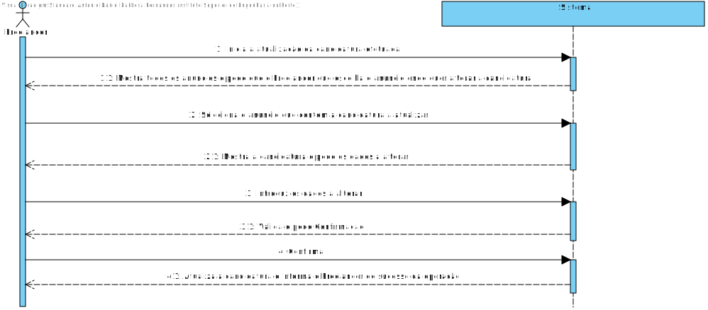
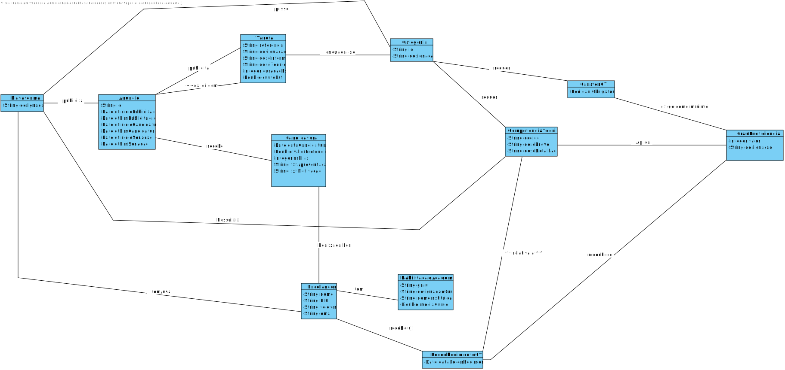
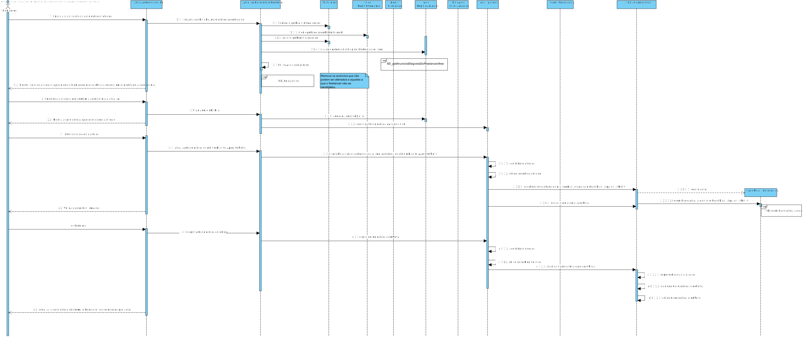
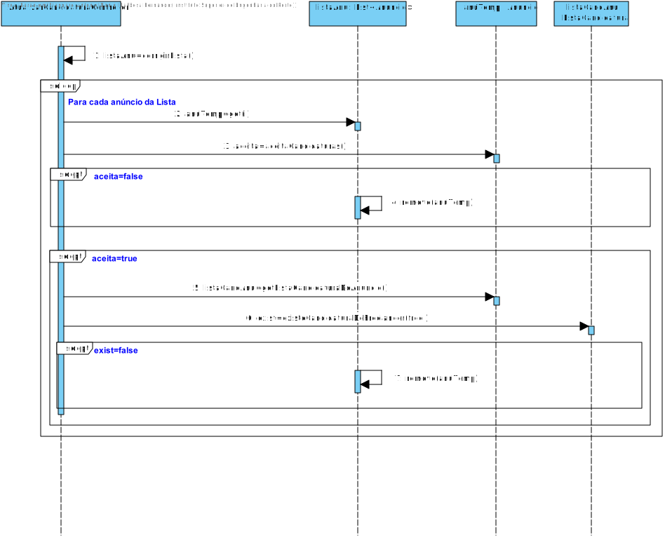
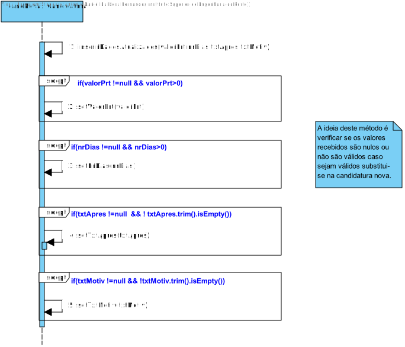
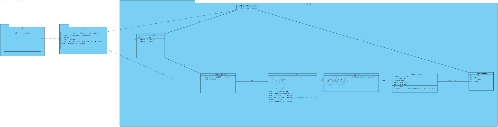

# UC11 - Atualizar Candidatura Submetida

## 1. Engenharia de Requisitos

### Formato Breve

O Freelancer inicia a atualização da candidatura.
O Sistema mostra a lista de anúncios para os quais o Freelancer é elegível e este escolhe um. Posteriormente o sistema pede os dados a alterar o freelancer insere os dados o sistema valida e pede confirmação. O Freelancer confirma e o sistema atualiza a candidatura e informa o Freelancer do sucesso da operação.

### Formato Completo

#### Ator principal

* Freelancer

#### Partes interessadas e seus interesses
* **Colaborador de Organização:** pretende receber Candidaturas, e que estas estejam atualizadas aos Anúncios publicados.
* **Organização:** pretende receber Candidaturas e ainda que estas estejam atualizadas, para serem associadas às Tarefas publicadas para execução por Freelancers.
* **Freelancer:** pretende atualizar a sua Candidatura.
* **T4J:** pretende ter as  Candidaturas atualizadas para posterior atribuição das tarefas a Freelancers.

#### Pré-condições

* A candidatura já existir.

#### Pós-condições

* É atualizada uma candidatura a um Anúncio.

#### Cenário de sucesso principal (ou fluxo básico)

1. O Freelancer inicia a atualização da candidatura efetuada.
2. O Sistema mostra os anúncios e pede que o Freelancer selecione aquele que possui a candidatura a atualizar.
3. O Freelancer seleciona o anúncio que contém a candidatura a atualizar.
4. O Sistema mostra a candidatura e pede os dados a alterar.
5. O Freelancer introduz os dados a alterar.
6. O Sistema valida e pede Confirmação.
7. O Freelancer confirma.
8. O Sistema atualiza a candidatura e informa o Freelancer do sucesso da operação.

### SSD

#### Extensões (ou fluxos alternativos)

*a. O Freelancer solicita o cancelamento da atualização da candidatura.
> O caso de uso termina.

6a. Nenhuns Dados Inseridos.
>	1. O sistema informa a falta de dados a atualizar.
>	2. O sistema permite a introdução dos dados (passo 5)
>
	> 2a. O freelancer não altera os dados. O caso de uso termina.

6b. O sistema deteta que os dados introduzidos (ou algum subconjunto dos dados) são inválidos.
>   1. O sistema alerta o Freelancer para o facto.
>   2. O sistema permite a sua alteração (passo 5).
>
	> 2a. O Freelancer não altera os dados. O caso de uso termina.

#### Requisitos especiais

\-

#### Lista de Variações de Tecnologias e Dados

\-

#### Frequência de Ocorrência

\-

#### Questões em aberto
Quais os atributos que se pode alterar?
A data de candidatura deve ser a do primeiro registo ou, caso haja atualização, a data da atualização?

## 2. Análise OO

### Excerto do Modelo de Domínio Relevante para o UC

## 3. Design - Realização do Caso de Uso

### Racional

| Fluxo Principal | Questão: Que Classe... | Resposta  | Justificação  |
|:--------------  |:---------------------- |:----------|:---------------------------- |
|1. O Freelancer inicia a atualização da candidatura efetuada. |... interage com o utilizador?|AtualizarCandidaturaUI	|Pure Fabrication|
| |...coordena o UC?	 				| AtualizarCandidaturaController	| Controller    |Pure Fabrication|
||...conhece o utilizador/Freelancer a usar o sistema?|SessaoUtilizador|IE: cf. documentação do componente de gestão de utilizadores.|
|	|...conhece o Freelancer ?|Plataforma|conhece todos os Freelancers|
|||RegistoFreelancer	|	Por aplicação de HC+LC delega a RegistoFreelancer|
|||Freelancer	|	IE:Freelancer conhece os seus próprios dados|
|2.mostra os anúncios e pede que o Freelancer selecione aquele que possui a candidatura a atualizar.|... conhece os anúncios?						     | RegistoAnuncios	|IE: no MD a Plataforma possui Anuncios. Por aplicação de HC+LC delega a RegistoAnuncios|
||| Anuncio	|IE: Anuncio conhece os seus próprios dados.|
| |...conhece os Anúncios elegíveis para o Freelancer| Freelancer 	| O Freelancer possui Reconhecimentos de Competências Técnicas | IE |  
| | 						     | Reconhecimento	| O Reconhecimento confirma o GrauProficiência do freelancer numa Competência Técnica | IE |  
| | 						     | Anúncio		| O Anúncio é relativo a uma Tarefa | IE: no MD o Anúncio é relativo a uma Tarefa |
| | 						     | Tarefa		| A Tarefa tem uma Categoria de Tarefa associada | IE: no MD a Tarefa é relativa a uma Categoria de Tarefa |
| | 						     | Categoria | A Categoria de Tarefa possui Carácter das Competências Técnicas | IE: no MD a Categoria de Tarefa possui CarácterCT |
| | 						     | CarácterCT | O Carácter de Competência Técnica possui GrauProficiência minino para cada CT e obrigatoriedade dessa CT | IE: no MD o CarácterCT possui GrauProficiência mínimo e obrigatoriedade|
| | 						     | GrauProficiência | A Competência Técnica possui os Graus de Proficiência para cada Competência Técnica | IE |
|3. O Freelancer seleciona o anúncio que contém a candidatura a atualizar.|||
|4. O Sistema mostra a candidatura e pede os dados a alterar|...quem conhece as candidaturas ao anúncio|Anuncio|IE:No MD Anúncio recebe Candidaturas|
| |							| ListaCandidaturas | Por aplicação de HC+LC delega a ListaCandidaturas|
| |							| Candidatura | IE: Candidatura conhece os seus dados|
|5. O Freelancer introduz os dados a alterar.|...quem guarda os dados?|Anuncio|No MD Anúncio recebe Candidaturas|
| |							| ListaCandidaturas | Por aplicação de HC+LC delega a ListaCandidaturas|
| |							| Candidatura | IE: Candidatura conhece os seus dados|
| 6.O Sistema mostra os dados e pede Confirmação.|	... valida os dados da Candidatura (validação local)?|Candidatura| IE: possui os seus próprios dados.|
| |	... valida os dados da Candidatura (validação global)?| ListaCandidaturas| IE: no MD o Anúncio recebe Candidaturas. Por aplicação de HC+LC delega a ListaCandidaturas|
|7. O Freelancer confirma.|N/A	|||
|8. O Sistema atualiza a candidatura e informa o Freelancer do sucesso da operação.|...guarda as alterções na Candidatura(apaga a antiga e adiciona a nova)?|Anuncio|IE: no MD o Anúncio recebe Candidaturas.|
| |							| ListaCandidaturas | IE: no MD o Anúncio recebe Candidaturas. Por aplicação de HC+LC delega a ListaCandidaturas|
| |...informa o colaborador?|AtualizarCandidaturaUI||

### Sistematização ##

 Do racional resulta que as classes conceptuais promovidas a classes de software são:

 * Plataforma
 * Candidatura
 * Freelancer
 * Anúncio

Outras classes de software (i.e. Pure Fabrication) identificadas:  

 * AtualizarCandidaturaUI
 * AtualizarCandidaturaController
 * RegistoFreelancer
 * RegistoAnuncios
 * ListaCandidaturas
 * Anuncio
 * Candidatura
 * Freelancer
 * SessaoUtilizador
 * Plataforma
Outras classes de sistemas/componentes externos:

 * SessaoUtilizador

###	Diagrama de Sequência

###	Diagrama de Classes

