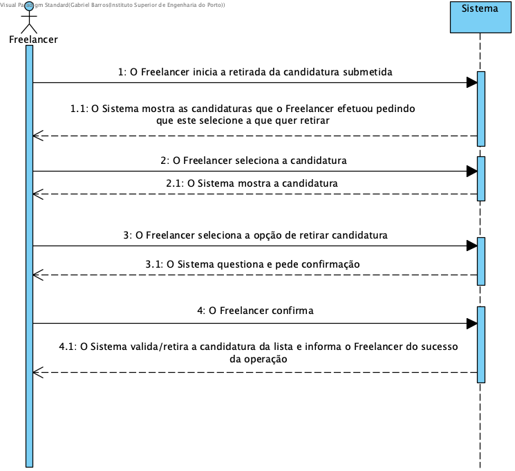
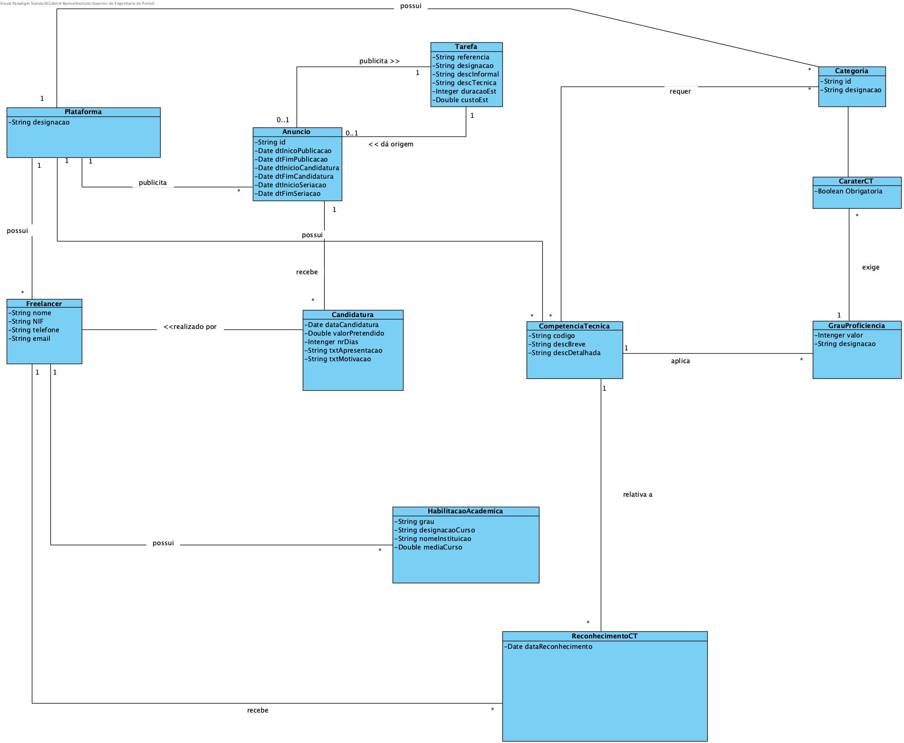
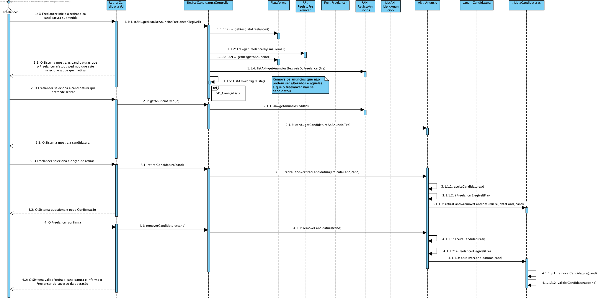
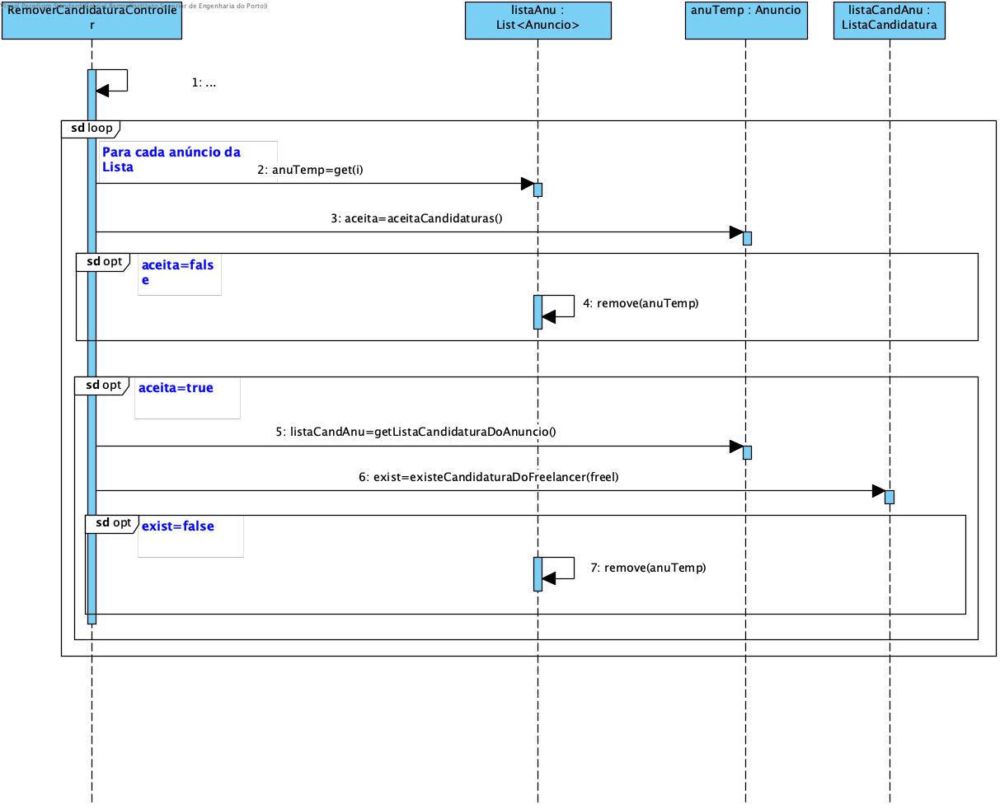
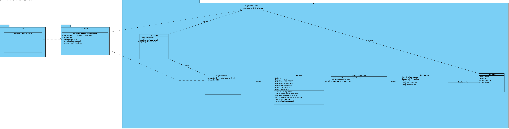

# UC12 - Retirar Candidatura Submetida

## 1. Engenharia de Requisitos

### Formato Breve

O Freelancer inicia a retirada da candidatura submetida. O Sistema mostra as candidaturas que o Freelancer efetuou pedindo que este selecione a que quer retirar.
O Freelancer seleciona a candidatura. O Sistema mostra a candidatura. O Freelancer seleciona a opção de retirar candidatura. O Sistema questiona e pede confirmação.
O Freelancer confirma. O Sistema valida/retira a candidatura da lista e informa o Freelancer do sucesso da operação.

### Formato Completo

#### Ator principal

* Freelancer

#### Partes interessadas e seus interesses
* **Colaborador de Organização:** pretende receber Candidaturas, caso estas não estejam retiradas.
* **Organização:** pretende receber Candidaturas, caso estas não estejam retiradas;
* **Freelancer:** pretende retirar a sua Candidatura.
* **T4J:** pretende ter a lista de Candidaturas atualizadas, com as candidaturas efetuadas para posterior atribuição das tarefas a Freelancers.

#### Pré-condições

* A candidatura já existir.

#### Pós-condições

* É retirada uma candidatura a um Anúncio.

#### Cenário de sucesso principal (ou fluxo básico)

1. O Freelancer inicia a retirada da candidatura efetuada.
2. O Sistema mostra as candidaturas que o Freelancer efetuou pedindo que este selecione a que quer retirar.
3. O Freelancer seleciona a candidatura que pretende retirar.
4. O Sistema mostra a candidatura.
5. O Freelancer seleciona a opção de retirar.
6. O Sistema questiona e pede Confirmação.
7. O Freelancer confirma.
8. O Sistema valida/retira a candidatura e informa o Freelancer do sucesso da operação.

### SSD

#### Extensões (ou fluxos alternativos)

*a. O Freelancer solicita o cancelamento da retirada da candidatura.
> O caso de uso termina.

2.1a. Nenhuns Dados Inseridos.
>	1. O sistema informa a falta de dados a atualizar.
>	2. O sistema permite a introdução dos dados (passo 2)
>
	> 2a. O freelancer não altera os dados. O caso de uso termina.

3.1b. O sistema deteta que os dados introduzidos (ou algum subconjunto dos dados) são inválidos.
>   1. O sistema alerta o Freelancer para o facto.
>   2. O sistema permite a sua alteração (passo 3).
>
	> 2a. O Freelancer não altera os dados. O caso de uso termina.

#### Requisitos especiais

\-

#### Lista de Variações de Tecnologias e Dados

\-

#### Frequência de Ocorrência

\-

#### Questões em aberto
O Freelancer pode retirar a candidatura quantas vezes ele quiser, para um anuncio especifico?

## 2. Análise OO

### Excerto do Modelo de Domínio Relevante para o UC

## 3. Design - Realização do Caso de Uso

### Racional

| Fluxo Principal | Questão: Que Classe... | Resposta  | Justificação  |
|:--------------  |:---------------------- |:----------|:---------------------------- |
|1. O Freelancer inicia a retirada da candidatura efetuada. |... interage com o utilizador?|RetirarCandidaturaUI	|Pure Fabrication|
| |...coordena o UC?	 				| RetirarCandidaturaController	| Controller    |Pure Fabrication|
||...conhece o utilizador/Freelancer a usar o sistema?|SessaoUtilizador|IE: cf. documentação do componente de gestão de utilizadores.|
|	|...conhece o Freelancer ?|Plataforma|conhece todos os Freelancers|
|||RegistoFreelancer	|	Por aplicação de HC+LC delega a RegistoFreelance|
|||Freelancer	|	IE:Freelancer conhece os seus próprios dados|
|2. O Sistema mostra as candidaturas que o Freelancer efetuou pedindo que este selecione a que quer retirar|...quem conhece as Candidaturas?|Anuncio|No MD Anúncio recebe Candidaturas|
| |							| ListaCandidaturas | Por aplicação de HC+LC delega a ListaCandidaturas|
| |							| Candidatura | IE: Candidatura conhece os seus dados|
|3. O Freelancer  Seleciona a candidatura que pretende retirar.||||
|4. O Sistema mostra a candidatura.|...quem conhece as candidaturas ao anúncio|Anuncio|IE:No MD Anúncio recebe Candidaturas|
| |							| ListaCandidaturas | Por aplicação de HC+LC delega a ListaCandidaturas|
| |							| Candidatura | IE: Candidatura conhece os seus dados|
|5. O Freelancer seleciona a opção de retirar a candidatura.|...quem guarda os dados?|Anuncio|No MD Anúncio recebe Candidaturas|
| |							| ListaCandidaturas | Por aplicação de HC+LC delega a ListaCandidaturas|
| |							| Candidatura | IE: Candidatura conhece os seus dados|
| 6.O Sistema questiona e pede Confirmação.|	... valida os dados da Candidatura (validação local)?|Candidatura| IE: possui os seus próprios dados.|
| |	... valida os dados da Candidatura (validação global)?| ListaCandidaturas| IE: no MD o Anúncio recebe Candidaturas. Por aplicação de HC+LC delega a ListaCandidaturas|
|7. O Freelancer confirma.|N/A	|||
|8. O Sistema valida/retira a candidatura e informa o Freelancer do sucesso da operação.|...guarda a retirada na Candidatura?|Anuncio|IE: no MD o Anúncio recebe Candidaturas.|
| |							| ListaCandidaturas | IE: no MD o Anúncio recebe Candidaturas. Por aplicação de HC+LC delega a ListaCandidaturas|
| |...informa o colaborador?|RetirarCandidaturaUI||

### Sistematização ##

 Do racional resulta que as classes conceptuais promovidas a classes de software são:

 * Plataforma
 * Candidatura
 * Freelancer
 * Anúncio

Outras classes de software (i.e. Pure Fabrication) identificadas:

 * RetirarCandidaturaUI
 * RetirarCandidaturaController
 * RegistoFreelancer
 * RegistoAnuncios
 * ListaCandidaturas
 * Anuncio
 * Candidatura
 * Freelancer
 * SessaoUtilizador
 * Plataforma
Outras classes de sistemas/componentes externos:

 * SessaoUtilizador

###	Diagrama de Sequência

###	Diagrama de Classes

