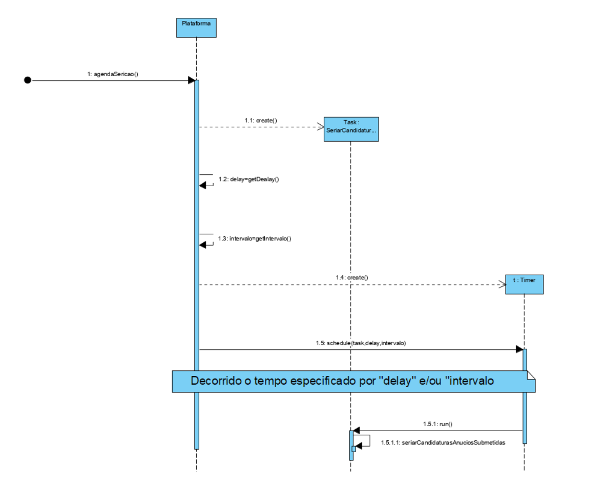
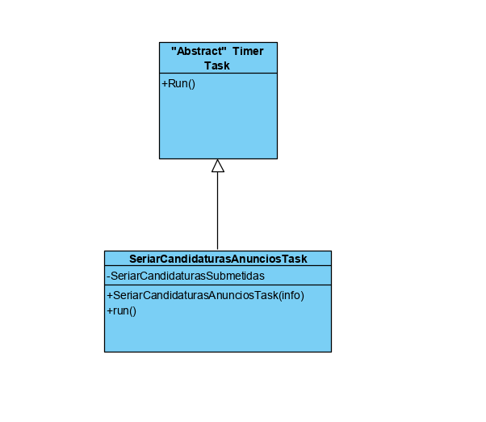
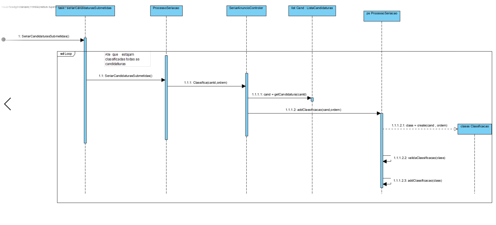
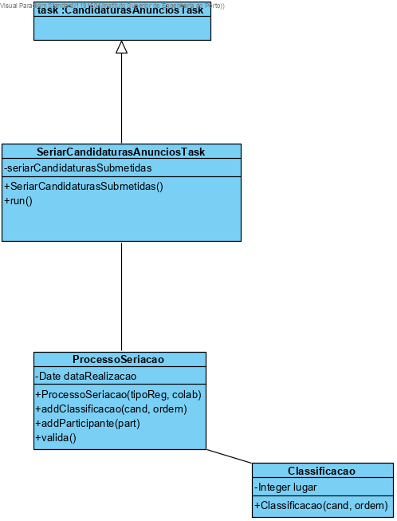

# UC13 – Seriar (automaticamente) Candidaturas de Anúncios

## 1. Engenharia de Requisitos

### Formato Breve

Os processos	 automáticos	 de	 seriação	 e	 atribuição são realizados pelas 2h 15m  de cada dia  e/ou imediatamente	 após	 a	 conclusão	 do	 processo	 de	 seriação	 não	 automático realizado	pelo	colaborador    

##SSD

### Formato Completo

1. Decorrido o tempo necessario e/ou imediatamente	 após	 a	 conclusão	 do	 processo	 de	 seriação	 não	 automático realizado	pelo	colaborado ocorre o processo de seriação.

#### Ator principal

Tempo

#### Partes interessadas e seus interesses

**colaborador (Anuciante)** - Quer saber a pessoa mais Classificado para a tarefa.
**Freelancer** - Quer saber se ficou com o trabalho

#### Pré-condições

1. Que chegue ao tempo estipulado ou/e  imediatamente	 após	 a	 conclusão	 do	 processo	 de	 seriação	 não	 automático realizado	pelo	colaborado

#### Pós-condições

1. Que a seriação automática ocorra

#### Cenário de sucesso principal (ou fluxo básico)

1. Que chegue ao tempo estipulado ou/e  imediatamente	 após	 a	 conclusão	 do	 processo	 de	 seriação	 não	 automático realizado	pelo	colaborado

2.  Que a seriação automática ocorra

#### Extensões (ou fluxos alternativos)

#### Requisitos especiais

#### Lista de Variações de Tecnologias e Dados

1. Mudança da hora estipulada

#### Frequência de Ocorrência

1. Sempre que chega a hora estipulada ou/e  imediatamente	 após	 a	 conclusão	 do	 processo	 de	 seriação	 não	 automático realizado	pelo	colaborado .

#### Questões em aberto

## 2. Análise OO

### Excerto do Modelo de Domínio Relevante para o UC

## 3. Design - Realização do Caso de Uso

### Racional

| Fluxo Principal | Questão: Que Classe... | Resposta  | Justificação  |
|:--------------  |:---------------------- |:----------|:---------------------------- |
1. Que chegue ao tempo estipulado ou/e  imediatamente	 após	 a	 conclusão	 do	 processo	 de	 seriação	 não	 automático realizado	pelo	colaborado | ... Que cria o tempo estipulado? ...| Plataforma|I.e |
2.  Que a seriação automática ocorra | ... quem corderna a seriação?  | SeriarCandidaturasAnunciosTask   | Task |
|  | ...que faz a seriação? |ProcessoSericao  |i.e UC10

(Para as Classes usadas para a Seriarção )

### Sistematização ##

* Plataforma
+ SeriarCandidaturasAnunciosTask

###	Diagrama de Sequência

###	Diagrama de Classes

