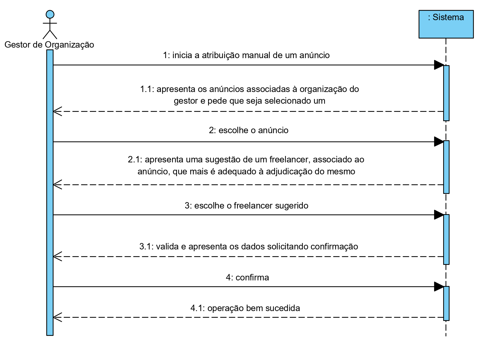
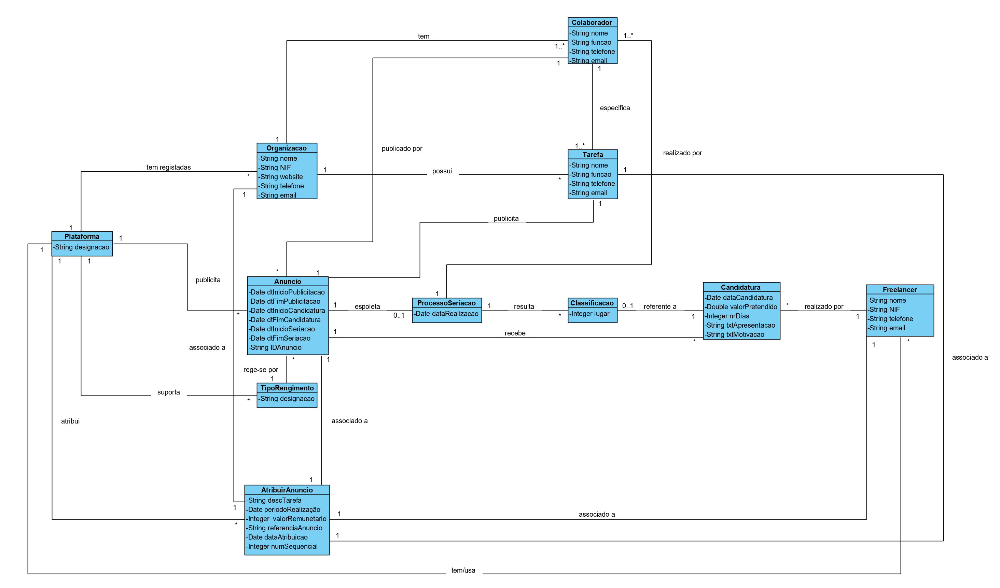
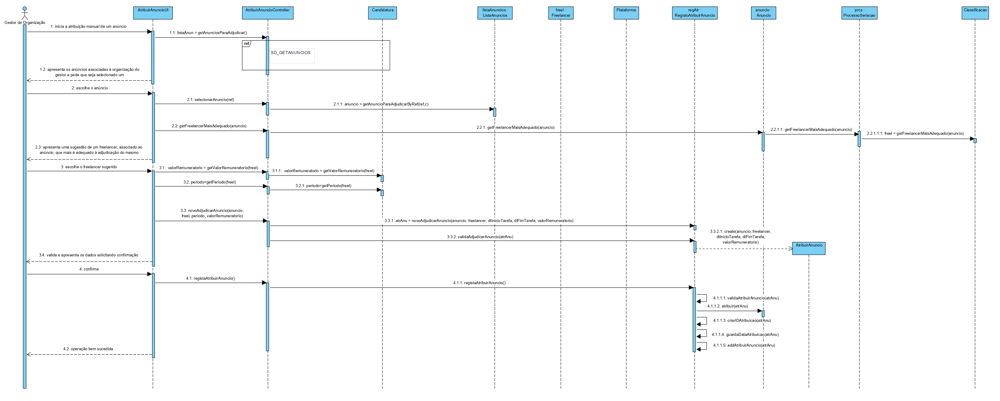
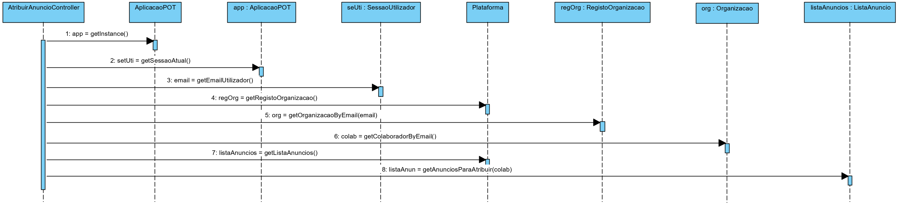
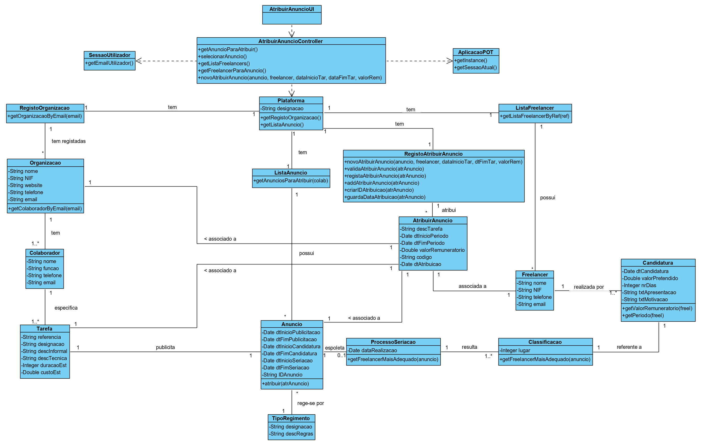

# UC 14 - Adjudicar/Atribuir (Manualmente) Anúncio

## 1. Engenharia de Requisitos

### Formato Breve

O gestor da organização inicia a atribuição manual de um anúncio. O sistema apresenta os anúncios associadas à organização do gestor e pede que seja selecionado um. O gestor escolhe o anúncio. O sistema, apresenta uma sugestão de um freelancer, associado ao anúncio, que mais é adequado à adjudicação do mesmo. O gestor confirma o freelancer sugerido. O sistema valida e apresenta os dados solicitando confirmação. O gestor da organização confirma. O sistema informa o gestor do sucesso da operação.

### SSD

### Formato Completo

#### Ator principal

* Gestor de Organização

#### Partes interessadas e seus interesses
* **Gestor de Organização:** pretende atribuir manualmente anúncios.
* **Organização:** pretende contratar freelancers para realizar as tarefas.
* **Freelancer:** pretende ser contratado para realizar uma tarefa.
* **T4J:** pretende que a sua aplicação seja usada.

#### Pré-condições

* Existencia de tarefas e de freelancers definidos no sistema.

#### Pós-condições

* É atribuida uma tarefa a um freelancer.

#### Cenário de sucesso principal (ou fluxo básico)

1. O gestor da organização inicia a atribuição manual de um anúncio.
2. O sistema apresenta os anúncios associadas à organização do gestor e pede que seja selecionado um.
3. O gestor escolhe o anúncio.
4. O sistema, apresenta uma sugestão de um freelancer, associado ao anúncio, que mais é adequado à adjudicação do mesmo.
5. O gestor aceita o freelancer.
6. O sistema valida e apresenta os dados solicitando confirmação.
7. O gestor da organização confirma.
8. O sistema gera um número único sequencial (por ano), guarda a data em que foi atribuido, regista os dados da atribuição e informa o gestor do sucesso da operação.

#### Extensões (ou fluxos alternativos)

*a. O gestor da organização solicita o cancelamento da atribuição da tarefa.
> O caso de uso termina.

2a. Não existem anúncios associados à organização do gestor.
> O caso de uso termina.

4a. Não existem candidaturas associadas ao anúncio escolhido.
> O caso de uso termina.

5a. Não aceita o freelancer que foi sugerido.
> O caso de uso termina.

#### Requisitos especiais
\-

#### Lista de Variações de Tecnologias e Dados
\-

#### Frequência de Ocorrência
\-

#### Questões em aberto

* Existem mais dados obrigatórios para além dos já especificados?
* Qual a frequência de ocorrência deste caso de uso?

## 2. Análise OO

### Excerto do Modelo de Domínio Relevante para o UC

## 3. Design - Realização do Caso de Uso

### Racional

| Fluxo Principal | Questão: Que Classe... | Resposta  | Justificação  |
|:--------------  |:---------------------- |:----------|:---------------------------- |
|1. O gestor da organização inicia a atribuição manual de um anúncio.|... interage com o utilizador?|AtribuirAnuncioUI|Pure Fabrication|
||... coordena o UC?|AtribuirAnuncioController|Controller|
||...conhece o gestor?|SessaoUtilizador|IE: cf. documentação do componente de gestão de utilizadores.|
|2. O sistema apresenta uma lista dos anúncios associadas à organização do gestor e pede que seja selecionado um.|...sabe a que organização o gestor pertence?|RegistoOrganizacao|IE: conhece todas as organizações..|
|||Organizacao|IE: conhece os seus colaboradores|
||...conhece o RegistoOrganizacao?|Plataforma|IE: a Plataforma tem RegistoOrganizacao|
||...conhece os anúncios?|Plataforma|IE: a Plataforma possui Anuncio|
|||ListaAnuncio|IE: no MD a Plataforma possui ListaAnuncio. Por aplicação de HC+LC delega a ListaAnuncio.|
||...cria a instância AtribuirAnuncio?|RegistoAtribuirAnuncio|IE:Creator(Regra1): no MD a Plataforma adjudica AtribuirAnuncio e por HC+LC delega a RegistoAtribuirAnuncio.|
|3. O gestor seleciona um anúncio.|... guarda o anuncio selecionado?|AtribuirAnuncio|IE: AtribuirAnuncio está associado a um Anuncio.|
|4. O sistema, apresenta uma sugestão de um freelancer, associado ao anúncio, que mais é adequado à adjudicação do mesmo.|...conhece os freelancers?|Plataforma|IE: no MD a Plataforma tem/usa Freelancer.|
|||ListaCandidaturas|IE: no MD a Plataforma tem/usa Freelancer. Por HC+LC delega a ListaFreelancer.|
||...faz a sugestão do freelancer mais adequado a atribuir o anúncio?|TipoRegimento|TipoRegimento rege a classe Anuncio, que depois irá ser atribuida.|
|5. O gestor aceita o freelancer sugerido.|...guarda o freelancer?|AtribuirAnuncio|IE: AtribuirAnuncio está associado a um freelancer.|
|6. O sistema valida e apresenta os dados solicitando confirmação.|...valida os dados do AtribuirAnuncio (validação local)?|AtribuirAnuncio|IE: possui os seus próprios dados.|
||...valida os dados do AtribuirAnuncio (validação global)?|RegistoAtribuirAnuncio|IE: por delegação da Plataforma|
|7. O gestor da organização confirma.|N/A|||
|8. O sistema gera um número único sequencial (por ano), guarda a data em que foi atribuido, regista os dados da atribuição e informa o gestor do sucesso da operação.|...guarda o AtribuirAnuncio?|RegistoAtribuirAnuncios|IE|
||...gera o número único sequencial e atribui a data em que a atribuição ocorreu?|AtribuirAnuncio|IE: possui os seus próprios dados.|

### Sistematização ##

 Do racional resulta que as classes conceptuais promovidas a classes de software são:

 * Plataforma
 * TipoRegimento
 * Organização
 * Anuncio
 * AtribuirAnuncio

Outras classes de software (i.e. Pure Fabrication) identificadas:  

 * AtribuirAnuncioUI  
 * AtribuirAnuncioController
 * RegistoAtribuirAnuncio
 * RegistoOrganizacao
 * ListaAnuncio
 * ListaCandidatura

###	Diagrama de Sequência

###	Diagrama de Classes

