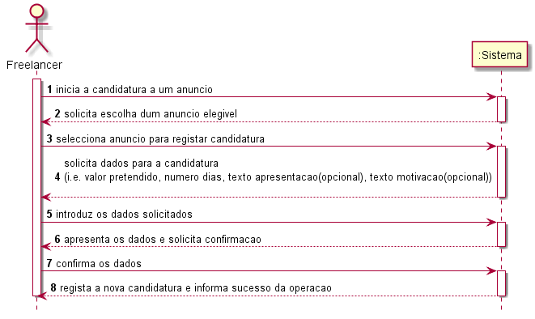
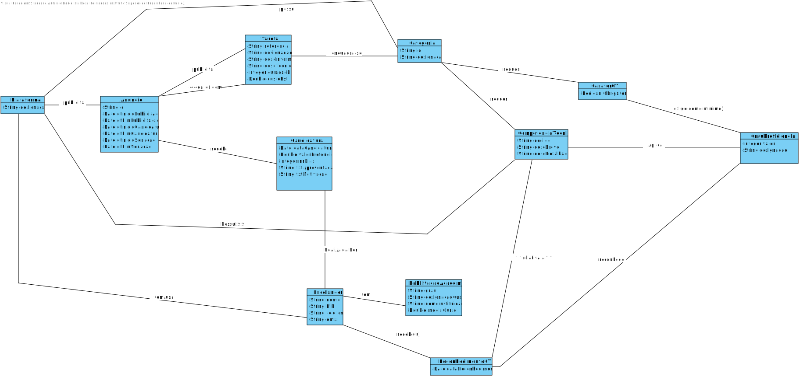
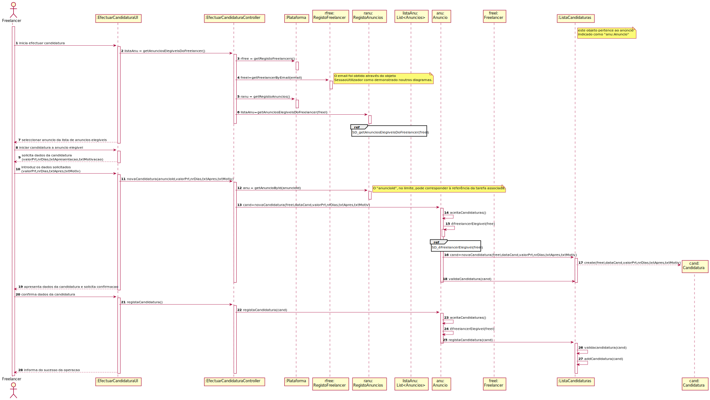

# UC 9 - Efetuar Candidatura

## 1. Engenharia de Requisitos

### Formato Breve

O Freelancer inicia a candidatura a um anúncio. O sistema solicita a escolha do anúncio duma lista de anúncios em período de candidatura e para os quais o Freelancer está elegível. O Freelancer identifica o anúncio para o qual pretende apresentar uma candidatura. O sistema solicita os dados necessários para a candidatura ao anúncio (i.e. valor pretendido, numero dias, texto apresentacão (opcional), texto motivação (opcional)). O Freelancer introduz os dados solicitados. O sistema valida e apresenta os dados ao Freelancer e pede a sua confirmação. O Freelancer confirma os dados. O sistema regista uma nova candidatura ao anúncio e informa o Freelancer do sucesso da operação.

### SSD

### Formato Completo

#### Ator principal

* Freelancer

#### Partes interessadas e seus interesses
* **Colaborador de Organização:** pretende receber Candidaturas aos Anúncios publicados.
* **Organização:** pretende receber Candidaturas para as Tarefas publicadas para execução por Freelancers.
* **Freelancer:** pretende conhecer os Anúncios a que se pode candidatar e apresentar a sua Candidatura.
* **T4J:** pretende receber Candidaturas para posterior atribuição das tarefas a Freelancers.

#### Pré-condições

*

#### Pós-condições

* É registada uma nova Candidatura a um Anúncio.

#### Cenário de sucesso principal (ou fluxo básico)

1. O Freelancer inicia a candidatura a um anúncio.
2. O sistema solicita a escolha do anúncio duma lista de anúncios em período de candidatura e para os quais o Freelancer está elegível.
3. O Freelancer identifica o anúncio para o qual pretende apresentar uma candidatura.
4. O sistema solicita os dados necessários para a candidatura ao anúncio (i.e. valor pretendido, numero dias, texto apresentacão (opcional), texto motivação(opcional)).
5. O Freelancer introduz os dados solicitados.
6. O sistema valida e apresenta os dados ao Freelancer e pede a sua confirmação.
7. O Freelancer confirma os dados.
8. O sistema regista uma nova candidatura ao anúncio e informa o Freelancer do sucesso da operação.

#### Extensões (ou fluxos alternativos)

*a. O Freelancer solicita o cancelamento da candidatura a anúncio.
> O caso de uso termina.

2a. Não existem anúncios em período de candidatura.
> O caso de uso termina.

2b. Não existem anúncios elegíveis para o Freelancer.
> O caso de uso termina.

6a. Dados mínimos obrigatórios em falta.
>	1. O sistema informa quais os dados em falta.
>	2. O sistema permite a introdução dos dados em falta (passo 4)
>
	> 2a. O freelancer não altera os dados. O caso de uso termina.

6b. O sistema deteta que os dados introduzidos (ou algum subconjunto dos dados) são inválidos.
>   1. O sistema alerta o Freelancer para o facto.
>   2. O sistema permite a sua alteração (passo 5).
>
	> 2a. O Freelancer não altera os dados. O caso de uso termina.

#### Requisitos especiais

\-

#### Lista de Variações de Tecnologias e Dados

\-

#### Frequência de Ocorrência

\-

#### Questões em aberto

* Qual é a informação do anúncio que o Freelancer pode visualizar? Toda?
* O Freelancer pode consultar as candidaturas efetuadas por outros Freelancers?

## 2. Análise OO

### Excerto do Modelo de Domínio Relevante para o UC

## 3. Design - Realização do Caso de Uso

### Racional

| Fluxo Principal | Questão: Que Classe... | Resposta  | Justificação  |
|:--------------  |:---------------------- |:----------|:---------------------------- |
| 1. O Freelancer inicia a candidatura a Anúncio |... interage com o utilizador?|EfectuarCandidaturaUI	|Pure Fabrication|
| |...coordena o UC?	 				| EfectuarCandidaturaController	| Controller    |Pure Fabrication|
| |...cria instância de Candidatura? 			| Anúncio | Creator (Regra1): no MD o Anúncio recebe Candidaturas|
| |							| ListaCandidaturas | IE: no MD o Anúncio recebe Candidaturas. Por aplicação de HC+LC delega a ListaCandidaturas|
| |...conhece o utilizador/Freelancer a usar o sistema?	|SessaoUtilizador|IE: cf. documentação do componente de gestão de utilizadores.|
| |...conhece o Freelancer ?				|Plataforma|conhece todos os Freelancers|
| |				|RegistoFreelancer|Por aplicação de HC+LC delega a RegistoFreelancer|
| 2. O sistema apresenta os anúncios elegíveis para o Freelancer e pede que seja selecionado um.|... conhece as anuncios? |Plataforma|IE: no MD a Plataforma possui Anúncios. |
| | 						     | RegistoAnuncios	|IE: no MD a Plataforma possui Anuncios. Por aplicação de HC+LC delega a RegistoAnuncios|
| |...conhece os Anúncios elegíveis para o Freelancer| Freelancer 	| O Freelancer possui Reconhecimentos de Competências Técnicas | IE |  
| | 						     | Reconhecimento	| O Reconhecimento confirma o GrauProficiência do freelancer numa Competência Técnica | IE |  
| | 						     | Anúncio		| O Anúncio é relativo a uma Tarefa | IE: no MD o Anúncio é relativo a uma Tarefa |
| | 						     | Tarefa		| A Tarefa tem uma Categoria de Tarefa associada | IE: no MD a Tarefa é relativa a uma Categoria de Tarefa |
| | 						     | Categoria | A Categoria de Tarefa possui Carácter das Competências Técnicas | IE: no MD a Categoria de Tarefa possui CarácterCT |
| | 						     | CarácterCT | O Carácter de Competência Técnica possui GrauProficiência minino para cada CT e obrigatoriedade dessa CT | IE: no MD o CarácterCT possui GrauProficiência mínimo e obrigatoriedade|
| | 						     | GrauProficiência | A Competência Técnica possui os Graus de Proficiência para cada Competência Técnica | IE |
| 3. O Freelancer seleciona um Anúncio elegível. | | | |
| 4. O sistema solicita os dados necessários para a candidatura (i.e. valor pretendido, numero dias, texto apresentacão(opcional), texto motivação(opcional)) |N/A|||
| 5. O Freelancer introduz os dados solicitados. | ... guarda os dados introduzidos?|Anúncio| No MD Anúncio recebe Candidaturas|
| |							| ListaCandidaturas | Por aplicação de HC+LC delega a ListaCandidaturas|
| |							| Candidatura | IE: Candidatura conhece os seus dados|
| 6. O sistema valida e apresenta os dados ao Freelancer e pede a sua confirmação.|	... valida os dados da Candidatura (validação local)?|Candidatura| IE: possui os seus próprios dados.|
| |	... valida os dados da Candidatura (validação global)?| ListaCandidaturas| IE: no MD o Anúncio recebe Candidaturas. Por aplicação de HC+LC delega a ListaCandidaturas|
| 7. O Freelancer confirma. | N/A|||
| 8. O sistema regista os dados e cria a Candidatura e informa o Freelancer do sucesso da operação. |...guarda a Candidatura?| Anúncio|IE: no MD o Anúncio recebe Candidaturas.|
| |							| ListaCandidaturas | IE: no MD o Anúncio recebe Candidaturas. Por aplicação de HC+LC delega a ListaCandidaturas|
| |...informa o colaborador?|EfectuarCandidaturaUI|

### Sistematização ##

 Do racional resulta que as classes conceptuais promovidas a classes de software são:

 * Plataforma
 * Candidatura
 * Freelancer
 * Reconhecimento
 * Grauproficiência
 * Anúncio
 * Tarefa
 * Categoria
 * CáracterCT
 * CompetênciaTécnica

Outras classes de software (i.e. Pure Fabrication) identificadas:  

 * EfectuarCandidaturaUI  
 * EfectuarCandidaturaController
 * RegistoFreelancer
 * RegistoAnuncios
 * ListaCandidaturas

Outras classes de sistemas/componentes externos:

 * SessaoUtilizador

###	Diagrama de Sequência

**Nota:** O diagrama relativo a "SD_éFreelancerElegivel(freel)" não é apresentado.
Existem várias formas de fazer este algoritmo.
Recomenda-se que tentem realizar o mesmo encontrando uma alternativa que preserve baixo acoplamento.
**É um excelente exercício de algoritmia.**
###	Diagrama de Classes

**Nota:** Algumas dependências estão omitidas.
